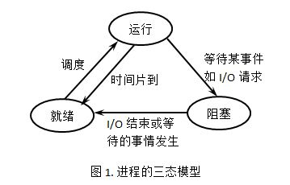
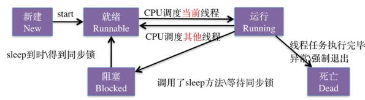

### 1、并发与并行 、同步与异步 、阻塞与非阻塞 的概念？
　　并发：是指两个或者多个事件在同一时刻发生；而并发是指两个或多个事件在同一时间间隔发生；
　　并行：是在不同实体上的多个事件，并发是在同一实体上的多个事件；

　　同步：当一个同步调用发出后，调用者要一直等待返回结果。通知后，才能进行后续的执行。
　　异步：当一个异步过程调用发出后，调用者不能立刻得到返回结果。实际处理这个调用的部件在完成后，通过状态、通知和回调来通知调用者。

　　阻塞：是指调用结果返回前，当前线程会被挂起，即阻塞。
　　非阻塞：是指即使调用结果没返回，也不会阻塞当前线程。

### 2、死锁

所谓死锁<DeadLock>: 是指两个或两个以上的进程在执行过程中,因争夺资源而造成的一种互相等待的现象,若无外力作用,它们都将无法推进下去.此时称系统处于死锁状态或系统产生了死锁,这些永远在互相等待的进程称为死锁进程.

#### 2.1 产生死锁的主要原因

　　（1） 资源竞争：系统资源不足，资源分配不当。
　　（2） 进程运行推进的顺序不当。
　　
　　如果系统资源充足，进程的资源请求都能够得到满足，死锁出现的可能性就很低，否则就会因争夺有限的资源而陷入死锁。其次，进程运行推进顺序与速度不同，也可能产生死锁。

#### 2.2 产生死锁的四个必要条件

　　（1） 互斥条件：一个资源每次只能被一个进程使用。
　　（2） 请求与保持条件：一个进程因请求资源而阻塞时，对已获得的资源保持不放。
　　（3） 不剥夺条件:进程已获得的资源，在末使用完之前，不能强行剥夺。
　　（4） 循环等待条件:若干进程之间形成一种头尾相接的循环等待资源关系。
　　
　　这四个条件是死锁的必要条件，只要系统发生死锁，这些条件必然成立，而只要上述条件之一不满足，就不会发生死锁。
　　

#### 2.3 解决死锁的基本方法

　　1. 预防死锁
　　2. 避免死锁
　　3. 检测死锁
　　4. 解除死锁

**（1）预防死锁**

　　1. 破坏请求条件：一次性分配所有资源，这样就不会再有请求了；
　　2. 破坏请保持条件：只要有一个资源得不到分配，也不给这个进程分配其他的资源：
　　3. 破坏不可剥夺条件：当某进程获得了部分资源，但得不到其它资源，则释放已占有的资源；
　　4. 破坏环路等待条件：系统给每类资源赋予一个编号，每一个进程按编号递增的顺序请求资源，释放则相反。

例如：有序资源分配法（破坏环路等待条件）

　　这种算法资源按某种规则系统中的所有资源统一编号（例如打印机为1、磁带机为2、磁盘为3、等等），申请时必须以上升的次序。系统要求申请进程：
　　
　　1、对它所必须使用的而且属于同一类的所有资源，必须一次申请完；
　　2、在申请不同类资源时，必须按各类设备的编号依次申请。例如：进程PA，使用资源的顺序是R1，R2； 进程PB，使用资源的顺序是R2，R1；若采用动态分配有可能形成环路条件，造成死锁。
　　采用有序资源分配法：R1的编号为1，R2的编号为2；
　　PA：申请次序应是：R1，R2
　　PB：申请次序应是：R1，R2
　　
　　这样就破坏了环路条件，避免了死锁的发生，即后来的申请者不可能会因为资源部分阻塞前面的申请者，可以保证最先申请的进程是绝对可以执行完的。

**（2）避免死锁**

【银行家算法】

银行家算法的核心就是找到一个安全序列。如果系统能找到一个安全序列，就称系统处于安全状态，不会发生死锁，否则，就称系统处于不安全状态，会发生思索。

安全序列是指系统能按某种进程推进顺序（P1, P2, P3, ..., Pn），为每个进程 Pi 分配其所需要的资源，直至满足每个进程对资源的最大需求，使每个进程都可以顺序地完成。这种推进顺序就叫安全序列

　　当进程首次申请资源时，要测试该进程对资源的最大需求量，如果系统现存的资源可以满足它的最大需求量则按当前的申请量分配资源，否则就推迟分配。
　　当进程在执行中继续申请资源时，先测试该进程已占用的资源数与本次申请资源数之和是否超过了该进程对资源的最大需求量。若超过则拒绝分配资源。若没超过则再测试系统现存的资源能否满足该进程尚需的最大资源量，若满足则按当前的申请量分配资源，否则也要推迟分配。

**（3）解除死锁**
 
　　1. 资源剥夺：挂起某些死锁进程，并抢占它的资源，将这些资源分配给其他死锁进程（但应该防止被挂起的进程长时间得不到资源）；
　　2. 撤销进程：强制撤销部分、甚至全部死锁进程并剥夺这些进程的资源（撤销的原则可以按进程优先级和撤销进程代价的高低进行）；
　　3. 进程回退：让一个或多个进程回退到足以避免死锁的地步。进程回退时自愿释放资源而不是被剥夺。要求系统保持进程的历史信息，设置还原点。

### 3、进程与线程

#### 3.1 进程的定义

　　进程是具有一定独立功能的程序关于某个数据集合上的一次运行活动，是系统进行资源分配和调度的一个独立单位。进程是程序的一次执行活动，是程序运行的实例，属于动态概念。进程是系统进行资源分配的基本单位。
（注意：在Mac、Windows NT等采用微内核结构的操作系统中，进程只是资源分配的单位，而不再是调度运行的单位。在微内核系统中，真正调度运行的基本单位是线程。因此，实现并发功能的单位是线程。 ）

进程的组成：程序段、相关数据段、进程控制块(PCB)，其中PCB是进程存在的唯一标识

#### 3.2 线程的定义

　　线程是进程的一个实体，是CPU调度和分派的基本单位，它是比进程更小的能独立运行的基本单位。线程是CPU调度和程序执行的最小单位。

#### 3.3 为什么有了进程，还要有线程呢？
 进程可以使多个程序并发执行，以提高资源的利用率和系统的吞吐量，但是其带来了一些缺点：

　　1. 进程在同一时间只能干一件事情；
　　2. 进程在执行的过程中如果阻塞，整个进程就会被挂起，即使进程中有些工作不依赖与等待的资源，仍然不会执行。

基于以上的缺点，操作系统引入了比进程粒度更小的线程，作为并发执行的基本单位，从而减少程序在并发执行时所付出的时间和空间开销，提高并发性能。

#### 3.4 进程和线程的关系

　　(1)一个线程只能属于一个进程，而一个进程可以有多个线程，但至少有一个线程。
　　(2)资源分配给进程，同一进程的所有线程共享该进程的所有资源。
　　(3)处理机分给线程，即真正在处理机上运行的是线程。
　　(4)线程在执行过程中，需要协作同步。不同进程的线程间要利用消息通信的办法实现同步。
　　(5)线程有自己的堆栈和局部变量，但线程之间没有单独的地址空间，一个线程死掉就等于整个进程死掉，所以多进程的程序要比多线程的程序健壮，但在进程切换时，耗费资源较大，效率要差一些。但对于一些要求同时进行并且又要共享某些变量的并发操作，只能用线程，不能用进程。

#### 3.5 进程与线程的区别

　　(1)调度：线程作为CUP调度和分配的基本单位，进程作为拥有资源的基本单位。
　　(2)并发性：不仅进程之间可以并发执行，同一个进程的多个线程之间也可并发执行。
　　(3)拥有资源：进程是拥有资源的一个独立单位，线程基本不拥有系统资源（也有一点必不可少的资源），但可以访问隶属于进程的资源。
　　(4)系统开销：在创建或撤消进程时，由于系统都要为之分配和回收资源，导致系统的开销明显大于创建或撤消线程时的开销。在进程切换时，耗费资源较大，效率要差一些。
　　(5)健壮性：进程有独立的地址空间，一个进程崩溃后，在保护模式下不会对其它进程产生影响，而线程只是一个进程中的不同执行路径。线程有自己的堆栈和局部变量，但线程之间没有单独的地址空间，一个进程死掉就等于所有的线程死掉，所以多进程的程序要比多线程的程序健壮。进程间的crash不会相互影响，但是一个线程的crash会使整个进程都crash，其他线程也跟着都挂了。
 
总的来讲：进程只是一些资源的集合，真正的程序执行都是线程来完成的，程序启动的时候操作系统就帮你创建了一个主线程。每个线程有自己的堆栈。

#### 3.6 进程的基本状态

进程经常讨论的基本状态为：就绪状态（Ready）、运行状态（Running）、阻塞状态（Blocked）。此外，还包括不常讨论的创建和结束。

 - 就绪状态：当进程已分配到除CPU以外的所有必要资源后，只要再获得CPU，便可立即执行，进程这时的状态称为就绪状态。在一个系统中处于就绪状态的进程可能有多个，通常将它们排成一个队列，称为就绪队列。

 - 运行状态：进程已获得CPU，其程序正在执行。在单处理机系统中，只有一个进程处于执行状态； 在多处理机系统中，则有多个进程处于执行状态。

 - 阻塞状态：正在执行的进程由于发生某事件而暂时无法继续执行时，便放弃处理机而处于暂停状态，亦即进程的执行受到阻塞，把这种暂停状态称为阻塞状态，有时也称为等待状态或封锁状态。致使进程阻塞的典型事件有：请求I/O，申请缓冲空间等。通常将这种处于阻塞状态的进程也排成一个队列。有的系统则根据阻塞原因的不同而把处于阻塞状态的进程排成多个队列。

三种状态的切换如下图所示：

另外有两个状态：创建状态、终止状态，一般不讨论。

#### 3.7 线程的基本状态

线程的基本状态包括：派生，阻塞，激活，调度，结束。

 - 新建（New）：线程在进程内派生出来，它即可由进程派生，也可由线程派生。

 - 阻塞（blocked）：线程运行过程中，可能由于各种原因进入阻塞状态：

① 线程通过调用sleep方法进入睡眠状态；
② 线程调用一个在I/O上被阻塞的操作，即该操作在输入输出操作完成之前不会返回到它的调用者；
③ 线程试图得到一个锁，而该锁正被其他线程持有；
④ 线程在等待某个触发条件；
所谓阻塞状态是正在运行的线程没有运行结束，暂时让出CPU，这时其他处于就绪状态的线程就可以获得CPU时间，进入运行状态。

 - 就绪（ready）：一个新创建的线程并不自动开始运行，要执行线程，必须调用线程的start()方法。当线程对象调用start()方法即启动了线程，start()方法创建线程运行的系统资源，并调度线程运行run()方法。当start()方法返回后，线程就处于就绪状态。处于就绪状态的线程并不一定立即运行run()方法，线程还必须同其他线程竞争CPU时间，只有获得CPU时间才可以运行线程

 - 运行（running）：线程获得CPU时间后，它才进入运行状态，真正开始执行run()方法。

 - 死亡（dead）：两个原因会导致线程死亡：

①run方法正常退出而自然死亡；

②一个未捕获的异常终止了run方法而使线程猝死；

五种状态的切换如下图所示：

#### 3.8 线程间的同步和通信

1.互斥锁

2.条件变量

3.信号量机制

#### 3.9 fock()函数

在Linux系统中，可使用fork()函数创建进程。但windows系统没有这个函数，故无法这样创建进程。

fork()函数调用一次，返回两次，有三种返回值：

　　(1) 返回0：在子进程中会返回0
　　(2) 返回一个整数：在父进程中返回创建的子进程pid，是一个整数
　　(3) 返回负值：创建出现错误，返回一个负值

一般在LInux系统中调用fork后，都会先进入创建的子进程中执行，所以会先返回0，然后再执行父进程，返回该子进程id

### 4、进程同步、进程间通信

进程同步：使并发执行的多个进程在执行次序上进行协调，使其能有效的共享资源和相互合作。
进程间通信：是指在不同进程之间传播或交换信息。

#### 4.1 进程同步

两种关系：互斥关系（资源共享关系），同步关系（功能合作关系）

**同步机制：**

 - 信号量机制：整型信号量、记录型信号量、AND型信号量、信号量集
 - 管程机制：（不介绍）
 
 **同步机制原则：** 空闲让进、忙则等待、有限等待、让权等待
 
 **信号量机制应用：**
  - 实现互斥：设置一互斥信号量，初值为1
  - 前趋关系：为每个对象设置一个信号量，初值都为0

#### 4.2 进程通信

**（1）低级通信：** 交换信息量很少

 - 信号量机制：如实现进程的同步与互斥

**（2）高级通信：** 用户可以利用操作系统所提供的一组通信命令传送大量数据，操作系统隐藏了通信实现细节。

 - 共享存储器系统：在存储器种划分出一个共享存储区。如ctrl+c、ctrl+v命令
 - 消息传递系统：进程间数据传递以消息(message)为单位。
 - 管道通信系统：可以看成是一种特殊的文件，但不属于其他任何文件系统，并且只存在于内存中，有队列的特点先进先出。有固定的读端和写端，一进程读，另一进程写，所以是半双工的。

**管道通信分：匿名管道和命名管道** 

 - 匿名管道：未命名的单向管道，用于父子进程、兄弟进程之间传输数据，且只能用于本机的两进程之间通信。
 - 命名管道：不仅可以在本机的进程之间通信，还可以实现跨网络的进程通信。
 
 
**Ps：** 另外有socket套接字通信，写web应用程序都是使用的它。

### 5、进程调度算法

根据系统的资源分配策略所规定的资源分配算法。

#### 5.1 先来先服务调度算法（FCFS）
先来先服务调度算法是一种最简单的调度算法，也称为先进先出或严格排队方案。当每个进程就绪后，它加入就绪队列。当前正运行的进程停止执行，选择在就绪队列中存在时间最长的进程运行。该算法既可以用于作业调度，也可以用于进程调度。先来先去服务比较适合于常作业（进程），而不利于段作业（进程）。

#### 5.2 短作业优先调度算法（SJF）
短作业优先调度算法是指对短作业优先调度的算法，从后备队列中选择一个或若干个估计运行时间最短的作业，将它们调入内存运行。 短作业优先调度算法是一个非抢占策略，他的原则是下一次选择预计处理时间最短的进程，因此短进程将会越过长作业，跳至队列头。
问题：长进程饥饿

#### 5.3 高响应比优先调度算法
高响应比优先调度算法主要用于作业调度，该算法是对 先来先服务调度算法和短作业优先调度算法的一种综合平衡，同时考虑每个作业的等待时间和估计的运行时间。在每次进行作业调度时，先计算后备作业队列中每个作业的响应比，从中选出响应比最高的作业投入运行。

计算公式：(等待时间 + 预计运行时间) / 预计运行时间

#### 5.4 时间片轮转调度算法
时间片轮转调度算法主要适用于分时系统。在这种算法中，系统将所有就绪进程按到达时间的先后次序排成一个队列，进程调度程序总是选择就绪队列中第一个进程执行，即先来先服务的原则，但仅能运行一个时间片。

#### 5.5 多级反馈队列调度算法
多个就绪队列，为每个队列设置不同的优先级。优先级越高的队列中的进程执行时间片越小。新进程放最高优先级队列中，队列中进程按先来先服务执行，当进程再时间片内未执行完则放入下一优先级队列尾等待调度。当高优先级队列空时才会调度低优先级队列的进程。

### 6、内存管理

#### 6.1 分页存储管理与分段存储管理

内存分配时产生的问题，如内存碎片，内存回收合并等。为了提高内存利用率，减小系统开销，产生两种思想：分页、分段。

**分页：**

　　分页存储管理是将一个进程的逻辑地址空间分成若干个大小相等的片，称为页面或页，并为各页从0开始加编号。相应的也把内存空间分成与页面相同大小的若干个存储快，称为(物理)块同样加编号。
　　页表：系统为每个进程建立一张页面映像表，称为页表。记录相应页在内存中对应的物理块号。

**分段：**

　　在分段存储管理方式中，程序被划分为若干个段，如主程序段、子程序段、数据段、栈段等。每个段从0编址，程序逻辑地址由断号和段内地址组成。系统为每个段分配一个连续的内存空间，进程的各个段可以离散的移入内存中不同的分区。
　　段表：像分页一样，操作系统为每个进程建立一张段表，记录每个段在内存中的起始地址和长度。

**分页与分段的区别？**

　　1. 段是信息的逻辑单位，它是根据用户的需要划分的，因此段对用户是可见的 ；页是信息的物理单位，是为了管理主存的方便而划分的，对用户是透明的；
　　2. 段的大小不固定，有它所完成的功能决定；页大大小固定，由系统决定；
　　3. 段向用户提供二维地址空间；页向用户提供的是一维地址空间；
　　4. 段是信息的逻辑单位，便于存储保护和信息的共享，页的保护和共享受到限制。

#### 6.2 物理地址、逻辑地址、虚拟内存的概念

　　1. 物理地址：它是地址转换的最终地址，进程在运行时执行指令和访问数据最后都要通过物理地址从主存中存取，是内存单元真正的地址。

　　2. 逻辑地址：是指计算机用户看到的地址。例如：当创建一个长度为 100 的整型数组时，操作系统返回一个逻辑上的连续空间：指针指向数组第一个元素的内存地址。由于整型元素的大小为 4 个字节，故第二个元素的地址时起始地址加 4，以此类推。事实上，逻辑地址并不一定是元素存储的真实地址，即数组元素的物理地址（在内存条中所处的位置），并非是连续的，只是操作系统通过地址映射，将逻辑地址映射成连续的，这样更符合人们的直观思维。

　　3. 虚拟内存：是计算机系统内存管理的一种技术。它使得应用程序认为它拥有连续的可用的内存（一个连续完整的地址空间），而实际上，它通常是被分隔成多个物理内存碎片，还有部分暂时存储在外部磁盘存储器上，在需要时进行数据交换。

#### 6.2 虚拟内存

　　从逻辑上扩充内存容量。基于局部性原理，在程序运行之前没必要全部装入内存，仅需将那些当前要运行的少数页面或段装入内存运行，其余部分留在磁盘，当需要访问的页/段不在内存（缺页或缺段），程序利用操作系统提供的请求调页/段功能将他们调入内存，若内存已满无法装入新的页/段，则利用页/段的置换功能，将内存中暂时不用的页/段调出至硬盘，再将需要的页/段调入内存。
　　实现了大的用户程序在较小内存空间中运行，内存中装入更多的进程使其并发执行的目的。

#### 6.3 页面置换算法

　　在进程运行过程中，从磁盘调入需要访问的页，但内存已无空闲空间时，根据一定的算法将内存中某些页调出至磁盘，再将所需页调入内存。这种调换过程，好的算法使缺页中断产生较少，页面更换频率降低。

**五种页置换算法：**

　　1、最佳置换算法（Optimal）：一种理论的算法，选着淘汰的页面是以后一定不再使用的页面（理想化的），该算法无法实现，只能作为其他算法好坏的一个评价对比。

　　2、先进先出（FIFO）算法：总是最先淘汰最先进去的页面，该算法容易实现。缺点：通常程序调入内存的先后顺序和程序执行的先后顺序不一致，导致缺页率高。

　　3、最近最久未使用算法（LRU）：选择一个最近最久没有使用过的记录删除。

　　4、最少使用算法（LFU）：在每个页面设置一个移位寄存器记录该页面的访问频率，最近时期最少使用的页面被淘汰

　　5、时钟（Clock）置换算法也叫最近未用算法 NRU（Not RecentlyUsed）。该算法为每个页面设置一位访问位，将内存中的所有页面都通过链接指针链成一个循环队列。

**内存抖动(颠簸)：**

　　本质是频繁的页调度。不断地产生缺页中断，不断地将页置换出去，又很快需要它。页面置换算法不恰当。

### 7、系统调用

　　系统调用是操作系统提供给应用程序（编程人员）使用的接口。

　　操作系统管理所有资源，操作系统提供“系统调用”的功能，用户进程想使用计算机的资源，通过系统调用命令像操作系统发出请求，由操作系统执行调用去实现功能。保证系统的稳定性和安全性，防止用户非法操作。

**系统调用分类：** (按功能分)

 - 设备管理
 - 文件管理
 - 进程管理
 - 进程通信
 - 存储器管理

**系统调用步骤：** 

　　(1)
　　(2)
　　(3)
　　(4)