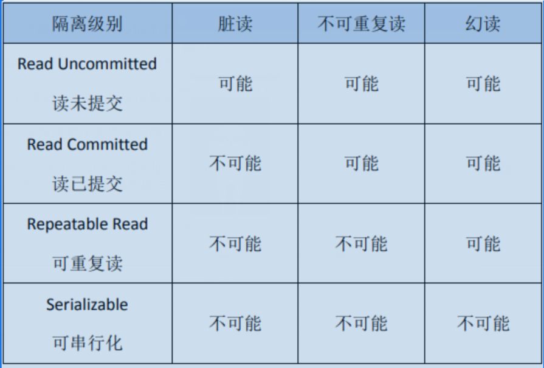
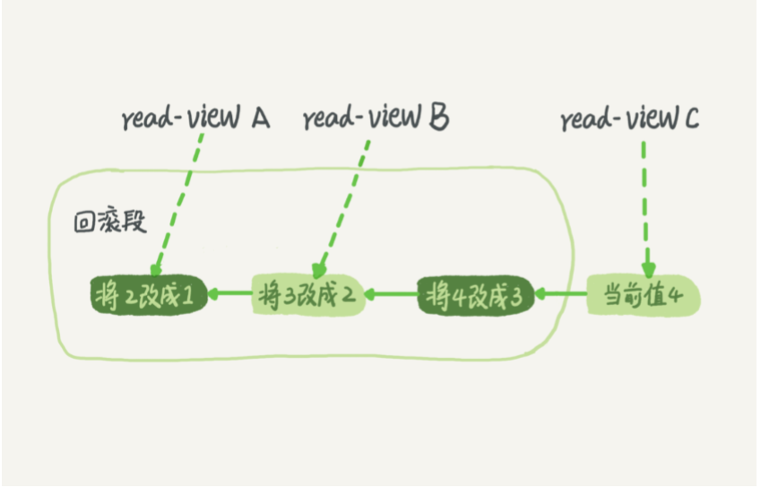

<!-- TOC -->
- [事务](#一、事务)
    - [什么是事务?](#什么是事务？)
    - [事务的隔离性与隔离级别](#隔离性与隔离级别)
- [事务的ACID特性及实现原理](#二、ACID特性及实现原理)
    - [1.原子性](#1.原子性)
    - [2.一致性](#2.一致性)
    - [3.隔离性](#3.隔离性)
        - [保证写-写事务的隔离性：锁机制](#①锁机制)
        - [保证写-读事物的隔离性：MVCC](#②MVCC（多版本并发控制协议）)
    - [4.持久性](#4.持久性)

<!-- /TOC -->

## 一、事务

### 什么是事务？

事务是访问和更新数据库的程序执行单元，事务中包含一条或者多条SQL语句，这些语句要么全部执行成功，要么都不执行。

在MySQL中，事务支持是在引擎层实现的，MySQL是一个支持多引擎的系统，但并不是所有的引擎都支持事务，比如MySQL原生的MyISAM引擎就不支持事务，而InnoDB很好的支持事务。

事务的ACID特性是原子性、一致性、隔离性、持久性。按照严格的标准，只有同时满足ACID特性的才是事务，但是在各大数据库厂商的实现中，真正满足ACID特性的事务极少。InnoDB引擎默认事务隔离级别是“可重复读”，未满足隔离性；Oracle默认的事务隔离级别是“读提交”，也不满足隔离性...

### 隔离性与隔离级别

隔离性是事务特性之一，当数据库上有多个事务同时执行的时候，就有可能出现“脏读”、“不可重复读”、“幻读”的问题。为了解决相应的这些问题，提出了“隔离级别”的概念。

**SQL标准的隔离级别包括：读未提交，读提交，可重复读，串行化。**需要明确的是，隔离的越严实，效率就会越低，因此很多时候我们需要在二者之间找到一个平衡点。

 - **读未提交：**一个事务还未提交，它做的变更就能被别的事务看见。
 - **读提交：**一事务在提交之后，它做的变更才能被其他事务看见。
 - **可重复读：**一个事务在执行过程中看到的数据总是和这个事务在启动时看见的数据是一致的。
 - **串行化：**对于同一记录，“写”会加“写锁”，“读”会加“读锁”。当出现读写锁冲突的时候，后访问的事务必须等前一个事务执行完成才能继续执行。（类似操作系统中对资源的互斥访问）

**实现上述隔离级别原理简述：**

“读未提交”直接返回记录上的最新值；“读提交”和“可重复读”在不同的时候建立视图，访问的时候以视图的逻辑结果为准。“读提交”在SQL语句开始执行的时候建立视图，“可重复读”在事务启动的时候创建视图，在整个事务存在期间都使用的这个视图；“串行化”直接用“加锁”的方式避免并行访问。

## 二、ACID特性及实现原理

### 1.原子性

原子性是指一个事务是一个不可分割的工作单位，其中的操作要么都做，要么都不做。如果事务中的某一条SQL执行失败，则已经执行的语句必须回滚，数据库退回到执行事务之前的状态。

实现原理：undo log（回滚日志）

InnoDB存储引擎提供了两种事务日志：

 - redo log（重做日志）
 - undo log（回滚日志）

redo log用于保持事务持久性，undo log是事务原子性和隔离性的实现基础。

 - 当事务对数据库进行修改的时候，InnoDB会生成对应的 undo log

 - 事务执行失败或者调用了rollback，事务进行回滚，利用 undo log 中的信息将数据回滚到修改之前的样子。

undo log 属于逻辑日志，它记录的是SQL执行相关的信息。当发生回滚的时候，InnoDB会根据 undo log 的内容做与之前相反的工作：

 - 对于每个 insert ，回滚的时候执行 delete
 - 对于每个 delete ，回滚的时候执行 insert
 - 对于每个 update ，回滚的时候会执行一个相反的 update 把数据该回去

以 update 为例，当事务执行 update 的时候，生成的 undo log 中会包含被修改行的主键（便于知道修改了哪些行）、修改了哪些列、及这些列在修改前后的值等信息，回滚的时候便可以利用这些信息将数据还原到 update 之前的状态。

### 2.一致性

一致性是指事务执行后，数据库的完整性约束没有被破坏，事务执行前后都是合法的数据状态。

数据库的完整性约束包括但不限于：

 - 实体完整性（如行的主键存在且唯一）
 - 列完整性（如字段类型、大小、长度符合要求）
 - 外键约束
 - 用户自定义完整性（如转账前后两个账户的余额和不变）

可以说，一致性是事务追求的最终目标。原子性、持久性、隔离性都是为了保证数据库状态的一致性。此外，除了数据库层面的保障，一致性的实现也需要应用层面进行保障。

实现：

 - 保证原子性、持久性、隔离性
 - 数据库本身提供保障，如不允许向整形列插入字符串值，字符串长度不超过列限制等
 - 应用层面的保证

### 3.隔离性

隔离性是指事务内部的操作与其他事务都是隔离的，并发执行的各个事务之间不能相互干扰

严格的隔离性，对应了事务隔离级别中的“可串行化”，但实际应用中出于性能方面的考虑很少会使用可串行化。

考虑简单的读写操作（不考虑带锁读等特殊操作），对隔离性的讨论分以下两个方面：

**- （事务A）写操作对（事务B）写操作的影响：锁机制保证隔离性**
**- （事务A）写操作对（事务B）读操作的影响：MVCC保证隔离性**

#### ①锁机制

隔离性要求同一时刻只能有一个事务对数据进行写操作，InnoDB存储引擎即是通过锁机制来保证这一点。

(1) 锁机制的基本原理概括：

  a.事务在修改数据之前，获得相应的锁。
  b.获得锁之后，事务方可以修改数据。
  c.在该事务操作期间，这部分数据是锁定的，其他事务想要修改数据，需要等待当前事务提交或者回滚释放锁。

(2) 按照粒度，锁可以分为表锁、行锁以及在二者之间的其他锁。表锁在操作时会锁定整张表，并发性能较差；行锁只锁定待操作的数据，并发性能好。由于加锁本身会消耗资源（获取锁，检查锁，释放锁都要消耗资源），因此在锁定数据较多的情况下选择使用表锁可以节省大量资源。

MySQL中不同的存储引擎支持的锁不一样，比如MyISAM只支持表锁，InnoDB同时支持表锁和行锁，且处于性能方面的考虑，绝大多数情况下都选择使用行锁。

(3) 查看锁信息（基于InnoDB存储引擎）

    select * from information_schema.innodb_locks; #查看锁的概况
    show engine innodb status; #InnoDB整体状态，包括锁的情况

#### ②MVCC（多版本并发控制协议）

(1) 在介绍MVCC之前，先看在并发情况下，读操作存在的三种问题：

 - 脏读：当前事务（A）可以读到其他事务（B）未提交的数据（这种数据称 脏数据）

 - 不可重复读：在事务A中先后两次读取同一个数据，两次读取到的数据不一致

 - 幻读：在事务A中按照某个条件先后两次查询数据库，两次查询结果的记录总条数不一致

脏读与不可重复读的区别：前者读取到的是其他事务未提交的数据，后者读到的是其他事务已经提交的数据。
不可重复读与幻读的区别：前者是数据自身变了，后者是数据的行数变了。

隔离级别与读问题的关系：

InnoDB存储引擎默认的隔离级别是可重复读（RR）。在SQL标准中，RR是无法避免幻读的，但是InnoDB中实现的RR却避免了幻读。

(2) RR解决上述三个问题，使用的是MVCC，即多版本的并发控制协议。

MVCC特点是在同一时刻，不同的事务读取到的数据可能是不同的（即多版本）。MVCC最大的优点是不加锁，因此读写不冲突，并发性能好。InnoDB实现的MVCC多个版本的数据可以共存，主要依靠的是隐藏列（也可以称之为标记位）和 undo log。其中隐藏列包括该行数据的版本号、删除时间、指向undo log 的指针等。

在 MySQL 中，实际上每条记录在更新的时候都会同时记录一条回滚操作。记录上的最新值，通过回滚操作，都可以得到前一个状态的值。

假设一个值从 1 被按顺序改成了 2、3、4，在回滚日志里面就会有类似下面的记录。
 

当前值是 4，但是在查询这条记录的时候，不同时刻启动的事务会有不同的 read-view。如图中看到的，在视图 A、B、C 里面，这一个记录的值分别是 1、2、4，同一条记录在系统中可以存 在多个版本，就是数据库的多版本并发控制（MVCC）。对于 read-view A，要得到 1，就必须 将当前值依次执行图中所有的回滚操作得到。同时，即使现在有另外一个事务正在将 4 改成 5，这个事务跟 read-view A、B、C 对 应的事务是不会冲突的。

**所以**解决脏读与不可重复读问题使用简单的MVCC即可，InnoDB 实现的 RR 还要使用 next-keylock 机制一起来避免了幻读现象。

(3) 当没有事务再需要用到这些回滚日志时，回滚日志会被删除。什么时候才不需要了呢？就是当系统里没有比这个回滚日志更早的 read-view 的时候。

由此我们得到一点注意事项：长事务意味着系统里面会存在很老的事务视图。由于这些事务随时可能访问数据库里面的任何数 据，所以这个事务提交之前，数据库里面它可能用到的回滚记录都必须保留，这就会导致大量占用存储空间。

### 4.持久性

持久性是指事务一旦提交，他对数据库的改变就是永久性的，接下来的其他操作或者故障不应该对其有任何影响。

实现原理：redo log

(1) redo log 和 undo log 都属于 InnoDB 的事务日志。下面介绍redo log的由来：

InnoDB 作为 MySQL 的存储引擎，数据是存放在磁盘中的，但如果每次读写数据都需要磁盘 IO，效率会很低。为此，InnoDB 提供了缓存(Buffer Pool)，Buffer Pool 中包含了磁盘中部分数据页的映射，作为访问数据库的缓冲：

 - 当从数据库读取数据时，会首先从 Buffer Pool 中读取，如果 Buffer Pool 中没有，则从磁盘读取后放入 Buffer Pool。
 - 当向数据库写入数据时，会首先写入 Buffer Pool，Buffer Pool 中修改的数据会定期刷新到磁盘中（这一过程称为刷脏）。

Buffer Pool 的使用大大提高了读写数据的效率，但是也带来了新的问题：如果 MySQL 宕机，而此时 Buffer Pool 中修改的数据还没有刷新到磁盘，就会导致数据的丢失，事务的持久性无法保证。

于是，redo log 被引入来解决这个问题：当数据修改时，除了修改 Buffer Pool 中的数据，还会在 redo log 记录这次操作；当事务提交时，会调用 fsync 接口对 redo log 进行刷盘。

如果 MySQL 宕机，重启时可以读取 redo log 中的数据，对数据库进行恢复：

 - redo log 采用的是 WAL（Write-ahead logging，预写式日志），所有修改先写入日志，再更新到 Buffer Pool，保证了数据不会因 MySQL 宕机而丢失，从而满足了持久性要求。

(2) 问题：既然 redo log 也需要在事务提交时将日志写入磁盘，为什么它比直接将 Buffer Pool 中修改的数据写入磁盘(即刷脏)要快呢？

主要有以下两方面的原因：

 - 刷脏是随机 IO，因为每次修改的数据位置随机，但写 redo log 是追加操作，属于顺序 IO。

 - 刷脏是以数据页（Page）为单位的，MySQL 默认页大小是 16KB，一个 Page 上一个小修改都要整页写入；而 redo log 中只包含真正需要写入的部分，无效 IO 大大减少。

(3) redo log 与 binlog

我们知道，在 MySQL 中还存在 binlog(二进制日志)也可以记录写操作并用于数据的恢复，但二者是有着根本的不同的。

作用不同：

 - redo log 是用于 crash recovery 的，保证 MySQL 宕机也不会影响持久性；
 - binlog 是用于 point-in-time recovery 的，保证服务器可以基于时间点恢复数据，此外 binlog 还用于主从复制。

层次不同：

 - redo log 是 InnoDB 存储引擎实现的，
 - binlog 是 MySQL 的服务器层实现的，同时支持 InnoDB 和其他存储引擎。

内容不同：

 - redo log 是物理日志，内容基于磁盘的 Page。
 - binlog 是逻辑日志，内容是一条条 sql。

写入时机不同：

 - redo log 的写入时机相对多元。前面曾提到，当事务提交时会调用 fsync 对 redo log 进行刷盘；这是默认情况下的策略，修改innodb_flush_log_at_trx_commit 参数可以改变该策略，但事务的持久性将无法保证。
除了事务提交时，还有其他刷盘时机：如 master thread 每秒刷盘一次 redo log 等，这样的好处是不一定要等到 commit 时刷盘，commit 速度大大加快。
 - binlog 在事务提交时写入。