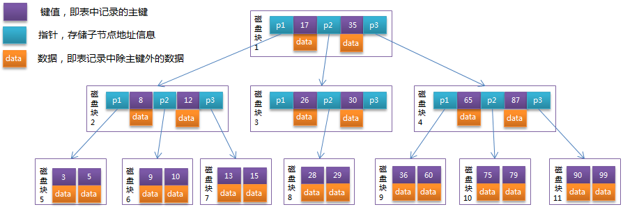
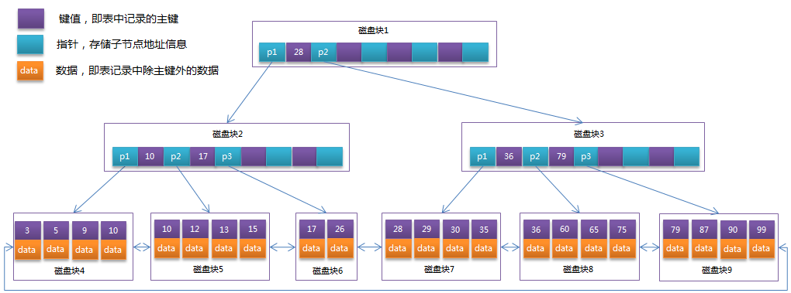

## 思维导图-索引篇

> 系列思维导图源文件（数据库+架构）以及思维导图制作软件—XMind8 破解安装，公众号后台回复：**“思维导图”** 免费领取！（下面的图片不是很清楚，原图非常清晰，另外提供给大家源文件也是为了大家根据自己需要进行修改）


## 索引的前世今生

### 什么是索引

**索引是一种实现高效获取数据的数据结构。Mysql中的索引是用B+树实现的。**

索引可以帮助我们快速地定位到数据而不需要每次搜索的时候都遍历数据库中的每一行。

在数据库系统中它具有以下优缺点。

**优点：**
1.大大加快数据的检索速度;
2.创建唯一性索引，保证数据库表中每一行数据的唯一性;
3.加速表和表之间的连接;
4.在使用order by、group by子句进行数据检索时，可以显著减少查询中分组和排序的时间。

**缺点：**
1.索引需要占物理空间。
2.当对表中的数据进行增加、删除和修改的时候，索引也要动态的维护，降低了数据的维护速度。

### 查找结构进化史

(1) 线性结构：数组，链表。实现简单，查找效率低。
(2) 二分查找：要求有序，插入慢。
(3) 哈希(hash)：查询极快，占用太多额外空间，不适合大规模数据，无范围查找。
(4) 二叉查找树：查询、插入较快。存在退化问题，树太高。
(6) 平衡树(AVL)：解决了二叉查找树退化问题，但依然存在树高度太高的问题。
(7) 多路查找树：节点很多时，树不会太高，但存在退化问题。
(8) 多路平衡查找树(BTree)：平衡树 + 多路查找树。无法范围查找。
(9) B+Tree：BTree的变种，可进行范围查找(双向链表链接所有叶子节点)。只有叶子节点存储数据(增大树的度，减小了树高度).

**关于BTree和B+Tree可以看这篇文章：**[什么是B树和B+树](../数据结构与算法/面试官问你什么B树和B+树，把这篇文章丢给他.md)


### 常见实现方式有哪些？

常见的实现索引的数据结构有哈希表、有序数组、搜索树（BTree,B+Tree）

#### 哈希表

使用哈希表实现的索引称为哈希索引。


如上图所示，我们将一系列的最终的键值通过哈希函数转化为存储实际数据桶的地址数值。值本身存储的地址就是基于哈希函数的计算结果，而搜索的过程就是利用哈希函数从元数据中推导出桶的地址。

**哈希冲突：** 
不同的键值通过哈希函数换算得到了相同的值。

**解决办法：**

 - 链地址法：将所有哈希地址为i的元素构成一个称为同义词链的单链表，并将单链表的头指针存在哈希表的第i个单元中，因而查找、插入和删除主要在同义词链中进行。链地址法适用于经常进行插入和删除的情况。

 - 再哈希法：这种方法是同时构造多个不同的哈希函数：Hi=RH1（key）  i=1，2，…，k。当哈希地址Hi=RH1（key）发生冲突时，再计算Hi=RH2（key）……，直到冲突不再产生。这种方法不易产生聚集，但增加了计算时间。

 - 开放定址法：这种方法也称再散列法，其基本思想是：当关键字key的哈希地址p=H（key）出现冲突时，以p为基础，产生另一个哈希地址p1，如果p1仍然冲突，再以p为基础，产生另一个哈希地址p2，…，直到找出一个不冲突的哈希地址pi ，将相应元素存入其中。

 - 建立公共溢出区：将哈希表分为基本表和溢出表两部分，凡是和基本表发生冲突的元素，一律填入溢出表。

**优缺点：** 
哈希索引会在进行相等性测试（等或者不等）时候具有非常高的性能，但是在进行比较查询、Order By 等更为复杂的场景下就无能为力。


#### 有序数组

按照给定的顺序排好序的数组

**优缺点：**
等值查询和比较查询性能非常优秀，但更新数据很繁琐，因为可能需要挪动大量的数据。所以这种索引结构适合静态存储引擎，存储不再改变的数据，如某学期的学生成绩信息。


#### 搜索树

最简单的是二叉搜索树，然后有平衡二叉树、B树（B-Tree/BTree）和B+树（B+Tree），甚至B*Tree。这些BTree、B+Tree、B*Tree都是一棵自平衡的搜索树，它类似普通的平衡二叉树，不同的一点是BTree允许每个节点有更多的子节点。BTree是专门为外部存储器设计的，如磁盘，它对于读取和写入大块数据有良好的性能，所以一般被用在文件系统及数据库中。

我们使用最多的两个存储引擎MyISAM和InnoDB都是 B+Tree 实现索引。而 BTree 索引是 MySQL 数据库中使用最为频繁的索引类型，除了 Archive 存储引擎之外的其他所有的存储引擎都支持 BTree 索引。Archive 引擎直到 MySQL 5.1 才支持索引，而且只支持索引单个 AUTO_INCREMENT 列。

不仅仅在 MySQL 中是如此，实际上在其他的很多数据库管理系统中BTree 索引也同样是作为最主要的索引类型，这主要是因为 B-Tree 索引的存储结构在数据库的数据检索中有非常优异的表现。


### 为何B树与B+树相比其他二叉搜索树更适合作为数据库索引的实现？

一般来说，索引本身也很大，不可能全部存储在内存中，因此索引往往以索引文件的形式存储的磁盘上。这样的话，索引查找过程中就要产生磁盘 I/O 消耗，相对于内存存取，I/O 存取的消耗要高几个数量级，所以评价一个数据结构作为索引的优劣最重要的指标就是在查找过程中磁盘 I/O 操作次数的渐进复杂度。换句话说，索引的结构组织要尽量减少查找过程中磁盘 I/O 的存取次数。

根据 B-Tree 的定义，可知检索一次最多需要访问 h 个节点。数据库系统的设计者巧妙利用了磁盘预读原理，将一个节点的大小设为等于一个页，这样每个节点只需要一次 I/O 就可以完全载入。（操作系统中一页大小通常是4KB）

每次新建节点时，直接申请一个页的空间，这样就保证一个节点物理上也存储在一个页里，加之计算机存储分配都是按页对齐的，就实现了一个节点只需一次 I/O。

而检索的时候，一次检索最多需要 h-1 次 I/O（根节点常驻内存），其渐进复杂度为


 
实际应用中，出度 d 是非常大的数字，通常超过 100，因此 h 非常小（通常不超过 3）。而其他搜索二叉树，h 明显要深的多。由于逻辑上很近的节点（父子）物理上可能很远，无法利用局部性，所以红黑树的 I/O 渐进复杂度也为 O(h)，效率明显比 B-Tree 差很多。


#### BTree的特点简述：
（1）所有键值分布在整个树中
（2）任何关键字出现且只出现在一个节点中
（3）搜索有可能在非叶子节点结束
（4）在关键字全集内做一次查找，性能逼近二分查找算法

一棵高度为3的B树：




#### B+Tree 是BTree的变种，有着比 BTree 更高的查询性能，其相较于 BTree 有了如下的变化：

 - 有 m 个子树的节点包含有 m 个元素（B-Tree 中是 m-1）。
 - 根节点和分支节点中不保存数据，只用于索引，所有数据都保存在叶子节点中。
 - 所有分支节点和根节点都同时存在于子节点中，在子节点元素中是最大或者最小的元素。
 - 叶子节点会包含所有的关键字，以及指向数据记录的指针，并且叶子节点本身是根据关键字的大小从小到大顺序链接。

**一般在数据库系统或文件系统中使用的 B+Tree 结构都在经典 B+Tree 的基础上进行了优化，增加了顺序访问指针。**

一棵高度为3的B+树：




通常在B+Tree上有两个头指针，一个指向根节点，另一个指向关键字最小的叶子节点，而且所有叶子节点（即数据节点）之间是一种链式环结构。因此可以对B+Tree进行两种查找运算：一种是对于主键的范围查找和分页查找，另一种是从根节点开始，进行随机查找。


### InnoDB存储引擎中的索引

InnoDB中索引的每个节点默认大小是16KB。

InnoDB中的索引分为：主键索引(聚集索引)和非主键索引(二级索引)

主键索引中叶子节点存储的数据是整行的完整数据。二级索引中叶子节点存储的数据是主键值。表中没有主键则将唯一字段认作主键，若没有唯一字段则自己建一个主键列。

查询时根据若查询条件是根据主键查询，则直接通过主键索引查找得到值。如果是根据其他的查询条件查询则会先到二级索引中查询出对应的主键值，再根据主键值到主键索引中去查找。（这个也叫做回表）

#### 索引维护

(1)数据插入与删除

插入数据的时候可能是直接插入或需要将部分数据往后挪空出插入位置再插入。

特殊情况：如果插入慢歌已经满了的数据页，则需要新申请一个数据页，然后将满的数据页的部分数据挪过去，最后再进行插入。（这个过程被称为**页分裂**）

如果插入的数据是向某个满数据页的首或者尾插入，为了减少页分裂和数据移动，会先看与这个满数据页相邻的前后数据页是否也已经满了，如果未满则会将该待插入数据先放置到前或后的数据页，满才会进行页分裂。（这样做是为了增加空间利用率）

同样，由于相邻两页删除了部分数据，两页的空间利用率都变得很低，会将这两数据页进行合并。（这个歌过程被称为**页合并**）

(2)最左前缀

联合索引的最左N个字段，或者字符串索引的前N个字符。

(3)覆盖索引

如果查询条件是非主键索引字段（或联合索引的最左原则字段），查询结果是主键（或联合索引的字段），不用回表，直接返回结果，这样减少了磁盘读取次数。

(4)联合索引

对多个字段一起建立一个索引，根据字段顺序以最左前缀原则进行检索。

(5)索引下推

建立联合索引(name,age)，查询语句如下：

    SELECT * FROM 表名 WHERE name like "helle" AND age>18;

这条语句在MySQL5.6之前对name匹配的数据直接进行回表，而5.6之后的版本，会先把name匹配的数据中age<=18的数据再进行过滤掉最后才进行回表。

----------

> **下面是补充的一些内容**

## 为什么索引能提高查询速度

> 以下内容整理自：
>  地址： https://juejin.im/post/5b55b842f265da0f9e589e79
>  作者 ：Java3y

### 先从 MySQL 的基本存储结构说起

MySQL的基本存储结构是页(记录都存在页里边)：


 - **各个数据页可以组成一个双向链表**
 -   **每个数据页中的记录又可以组成一个单向链表**
       - 每个数据页都会为存储在它里边儿的记录生成一个页目录，在通过主键查找某条记录的时候可以在页目录中使用二分法快速定位到对应的槽，然后再遍历该槽对应分组中的记录即可快速找到指定的记录
       - 以其他列(非主键)作为搜索条件：只能从最小记录开始依次遍历单链表中的每条记录。

所以说，如果我们写select * from user where indexname = 'xxx'这样没有进行任何优化的sql语句，默认会这样做：

1. **定位到记录所在的页：需要遍历双向链表，找到所在的页**
2. **从所在的页内中查找相应的记录：由于不是根据主键查询，只能遍历所在页的单链表了**

很明显，在数据量很大的情况下这样查找会很慢！这样的时间复杂度为O（n）。


### 使用索引之后

索引做了些什么可以让我们查询加快速度呢？其实就是将无序的数据变成有序(相对)：


要找到id为8的记录简要步骤：


很明显的是：没有用索引我们是需要遍历双向链表来定位对应的页，现在通过 **“目录”** 就可以很快地定位到对应的页上了！（二分查找，时间复杂度近似为O(logn)）

其实底层结构就是B+树，B+树作为树的一种实现，能够让我们很快地查找出对应的记录。

## 关于索引其他重要的内容补充

> 以下内容整理自：《Java工程师修炼之道》


### 最左前缀原则

MySQL中的索引可以以一定顺序引用多列，这种索引叫作联合索引。如User表的name和city加联合索引就是(name,city)，而最左前缀原则指的是，如果查询的时候查询条件精确匹配索引的左边连续一列或几列，则此列就可以被用到。如下：        

```                                                                                       
select * from user where name=xx and city=xx ; ／／可以命中索引
select * from user where name=xx ; // 可以命中索引
select * from user where city=xx ; // 无法命中索引            
```                                                          
这里需要注意的是，查询的时候如果两个条件都用上了，但是顺序不同，如 `city= xx and name ＝xx`，那么现在的查询引擎会自动优化为匹配联合索引的顺序，这样是能够命中索引的。

由于最左前缀原则，在创建联合索引时，索引字段的顺序需要考虑字段值去重之后的个数，较多的放前面。ORDER BY子句也遵循此规则。

### 注意避免冗余索引

冗余索引指的是索引的功能相同，能够命中 就肯定能命中 ，那么 就是冗余索引如（name,city ）和（name ）这两个索引就是冗余索引，能够命中后者的查询肯定是能够命中前者的 在大多数情况下，都应该尽量扩展已有的索引而不是创建新索引。

MySQL 5.7 版本后，可以通过查询 sys 库的 `schema_redundant_indexes` 表来查看冗余索引             

### Mysql如何为表字段添加索引？？？

1.添加PRIMARY KEY（主键索引）

```
ALTER TABLE `table_name` ADD PRIMARY KEY ( `column` ) 
```
2.添加UNIQUE(唯一索引) 

```
ALTER TABLE `table_name` ADD UNIQUE ( `column` ) 
```
 
3.添加INDEX(普通索引) 

```
ALTER TABLE `table_name` ADD INDEX index_name ( `column` )
```
 
4.添加FULLTEXT(全文索引) 

```
ALTER TABLE `table_name` ADD FULLTEXT ( `column`) 
```
 
5.添加多列索引

```
ALTER TABLE `table_name` ADD INDEX index_name ( `column1`, `column2`, `column3` )
```


## 参考

- 《Java工程师修炼之道》
- 《MySQL高性能书籍_第3版》
- https://juejin.im/post/5b55b842f265da0f9e589e79
                           
