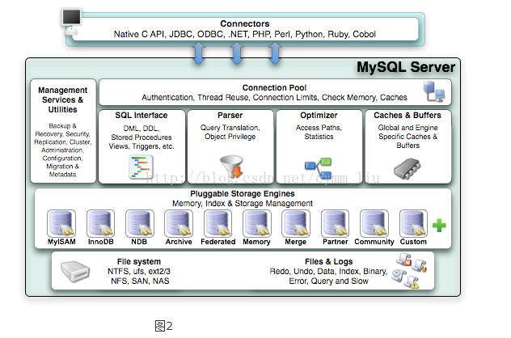
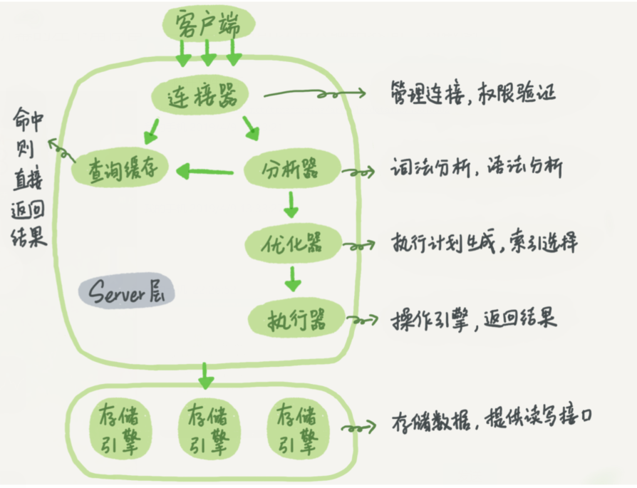

本文来自[木木匠](https://github.com/kinglaw1204)投稿，有改动。

<!-- TOC -->

- [一 MySQL 基础架构分析](#一、MySQL基础架构分析)
    - [1.1 MySQL 基本架构概览](#MySQL基本架构概览)
    - [1.2 Server 层基本组件介绍](#Server层基本组件介绍)
        - [1) 连接器](#1.连接器)
        - [2) 查询缓存(MySQL 8.0 版本后移除)](#2.查询缓存(MySQL8.0版本后移除))
        - [3) 分析器](#3.分析器)
        - [4) 优化器](#4.优化器)
        - [5) 执行器](#5.执行器)
- [二 语句分析](#二-语句分析)
    - [2.1 查询语句](#2.1查询语句)
    - [2.2 更新语句](#2.2更新语句)
- [三 总结](#三-总结)
- [四 参考](#四-参考)

<!-- /TOC -->

本篇文章会分析下一个 sql 语句在 MySQL 中的执行流程，包括 sql 的查询在 MySQL 内部会怎么流转，sql 语句的更新是怎么完成的。

在分析之前我会先带着你看看 MySQL 的基础架构，知道了 MySQL 由那些组件组成已经这些组件的作用是什么，可以帮助我们理解和解决这些问题。

## 一、MySQL基础架构分析

### MySQL基本架构概览

下图是MySQL逻辑架构图，从下图你可以很清晰的看到用户的 SQL 语句在 MySQL 内部是如何执行的。



**MySQL逻辑架构分四层**

1.连接层：主要完成一些类似连接处理，授权认证及相关的安全方案。

2.服务层：在 MySQL据库系统处理底层数据之前的所有工作都是在这一层完成的，包括权限判断，SQL接口，SQL解析，SQL分析优化， 缓存查询的处理以及部分内置函数执行(如日期,时间,数学运算,加密)等等。各个存储引擎提供的功能都集中在这一层，如存储过程，触发器，视图等。

3.引擎层：是底层数据存取操作实现部分，由多种存储引擎共同组成。真正负责MySQL中数据的存储和提取。就像Linux众多的文件系统 一样。每个存储引擎都有自己的优点和缺陷。服务器是通过存储引擎API来与它们交互的。这个接口隐藏 了各个存储引擎不同的地方。对于查询层尽可能的透明。这个API包含了很多底层的操作。如开始一个事物，或者取出有特定主键的行。存储引擎不能解析SQL，互相之间也不能通信。仅仅是简单的响应服务器 的请求。

4.存储层：将数据存储于裸设备的文件系统之上，完成与存储引擎的交互。

参考[张冲andy的文章：MySQL逻辑架构概述](https://www.cnblogs.com/andy6/p/5789254.html)

**简单来说 MySQL  主要分为 Server 层和存储引擎层：**

- Server 层：主要包括连接器、查询缓存、分析器、优化器、执行器等，所有跨存储引擎的功能都在这一层实现，比如存储过程、触发器、视图，函数等，还有一个通用的日志模块 binglog 日志模块。
- 存储引擎： 主要负责数据的存储和读取，采用可以替换的插件式架构，支持 InnoDB、MyISAM、Memory 等多个存储引擎，其中 InnoDB 引擎有自有的日志模块 redolog 模块。**现在最常用的存储引擎是 InnoDB，它从 MySQL 5.5.5 版本开始就被当做默认存储引擎了。**

查看MySQL中现在提供的存储引擎：

    show engines;

查看MySQL现在默认使用的存储引擎：

    show variables like '%storage_engine%';

查看某表使用的存储引擎：

    show create table 表名;

从上面MySQL逻辑架构图可以看到，MySQL有很多种存储引擎，他们以插件的形式存在，需要那个存储引擎则装上那个存储引擎。
其实在MySQL中主要使用MyISAM引擎和InnoDB引擎。

**MyISAM引擎和InnoDB引擎简单对比：**


||MyISAM引擎|InnoDB引擎|
|------------|-----------|------------|
|主外键|不支持|支持|
|事务|不支持|支持|
|行表锁|表所.不适合高并发|行锁.适合高并发|
|缓存|只缓存索引|缓存索引和真实数据|
|表空间|小|大|
|关注点|性能.偏读|事务|
|默认安装|是|是|


### Server层基本组件介绍

#### 1.连接器

连接器主要和身份认证和权限相关的功能相关，就好比一个级别很高的门卫一样。

主要负责用户登录数据库，进行用户的身份认证，包括校验账户密码，权限等操作，如果用户账户密码已通过，连接器会到权限表中查询该用户的所有权限，之后在这个连接里的权限逻辑判断都是会依赖此时读取到的权限数据，也就是说，后续只要这个连接不断开，即时管理员修改了该用户的权限，该用户也是不受影响的。

#### 2.查询缓存(MySQL8.0版本后移除)

查询缓存主要用来缓存我们所执行的 SELECT 语句以及该语句的结果集。

连接建立后，执行查询语句的时候，会先查询缓存，MySQL 会先校验这个 sql 是否执行过，以 Key-Value 的形式缓存在内存中，Key 是查询预计，Value 是结果集。如果缓存 key 被命中，就会直接返回给客户端，如果没有命中，就会执行后续的操作，完成后也会把结果缓存起来，方便下一次调用。当然在真正执行缓存查询的时候还是会校验用户的权限，是否有该表的查询条件。

MySQL 查询不建议使用缓存，因为查询缓存失效在实际业务场景中可能会非常频繁，假如你对一个表更新的话，这个表上的所有的查询缓存都会被清空。对于不经常更新的数据来说，使用缓存还是可以的。

所以，一般在大多数情况下我们都是不推荐去使用查询缓存的。

MySQL 8.0 版本后删除了缓存的功能，官方也是认为该功能在实际的应用场景比较少，所以干脆直接删掉了。

#### 3.分析器

MySQL 没有命中缓存，那么就会进入分析器，分析器主要是用来分析 SQL 语句是来干嘛的，分析器也会分为几步：

**第一步，词法分析**，一条 SQL 语句有多个字符串组成，首先要提取关键字，比如 select，提出查询的表，提出字段名，提出查询条件等等。做完这些操作后，就会进入第二步。

**第二步，语法分析**，主要就是判断你输入的 sql 是否正确，是否符合 MySQL 的语法。

完成这 2 步之后，MySQL 就准备开始执行了，但是如何执行，怎么执行是最好的结果呢？这个时候就需要优化器上场了。

#### 4.优化器 

优化器的作用就是它认为的最优的执行方案去执行（有时候可能也不是最优，这篇文章涉及对这部分知识的深入讲解），比如多个索引的时候该如何选择索引，多表查询的时候如何选择关联顺序等。

可以说，经过了优化器之后可以说这个语句具体该如何执行就已经定下来。

#### 5.执行器

当选择了执行方案后，MySQL 就准备开始执行了，首先执行前会校验该用户有没有权限，如果没有权限，就会返回错误信息，如果有权限，就会去调用引擎的接口，返回接口执行的结果。

## 二 语句分析 

**MySQL语句执行流程图**



### 2.1查询语句

说了以上这么多，那么究竟一条 sql 语句是如何执行的呢？其实我们的 sql 可以分为两种，一种是查询，一种是更新（增加，更新，删除）。我们先分析下查询语句，语句如下：

```sql
select * from tb_student  A where A.age='18' and A.name=' 张三 ';
```

结合上面的说明，我们分析下这个语句的执行流程：

* 先检查该语句是否有权限，如果没有权限，直接返回错误信息，如果有权限，在 MySQL8.0 版本以前，会先查询缓存，以这条 sql 语句为 key 在内存中查询是否有结果，如果有直接缓存，如果没有，执行下一步。
* 通过分析器进行词法分析，提取 sql 语句的关键元素，比如提取上面这个语句是查询 select，提取需要查询的表名为 tb_student,需要查询所有的列，查询条件是这个表的 id='1'。然后判断这个 sql 语句是否有语法错误，比如关键词是否正确等等，如果检查没问题就执行下一步。
* 接下来就是优化器进行确定执行方案，上面的 sql 语句，可以有两种执行方案：
  
        a.先查询学生表中姓名为“张三”的学生，然后判断是否年龄是 18。
        b.先找出学生中年龄 18 岁的学生，然后再查询姓名为“张三”的学生。
    那么优化器根据自己的优化算法进行选择执行效率最好的一个方案（优化器认为，有时候不一定最好）。那么确认了执行计划后就准备开始执行了。

* 进行权限校验，如果没有权限就会返回错误信息，如果有权限就会调用数据库引擎接口，返回引擎的执行结果。

### 2.2更新语句

以上就是一条查询 sql 的执行流程，那么接下来我们看看一条更新语句如何执行的呢？sql 语句如下：

```
update tb_student A set A.age='19' where A.name=' 张三 ';
```
我们来给张三修改下年龄，在实际数据库肯定不会设置年龄这个字段的，不然要被技术负责人打的。其实条语句也基本上会沿着上一个查询的流程走，只不过执行更新的时候肯定要记录日志啦，这就会引入日志模块了，MySQL 自带的日志模块式 **binlog（归档日志）** ，所有的存储引擎都可以使用，我们常用的 InnoDB 引擎还自带了一个日志模块 **redo log（重做日志）**，我们就以 InnoDB 模式下来探讨这个语句的执行流程。流程如下：

* 先查询到张三这一条数据，如果有缓存，也是会用到缓存。
* 然后拿到查询的语句，把 age 改为 19，然后调用引擎 API 接口，写入这一行数据，InnoDB 引擎把数据保存在内存中，同时记录 redo log，此时 redo log 进入 prepare 状态，然后告诉执行器，执行完成了，随时可以提交。
* 执行器收到通知后记录 binlog，然后调用引擎接口，提交 redo log 为提交状态。
* 更新完成。

**这里肯定有同学会问，为什么要用两个日志模块，用一个日志模块不行吗?**

这是因为最开始 MySQL 并没与 InnoDB 引擎( InnoDB 引擎是其他公司以插件形式插入 MySQL 的) ，MySQL 自带的引擎是 MyISAM，但是我们知道 redo log 是 InnoDB 引擎特有的，其他存储引擎都没有，这就导致会没有 crash-safe 的能力(crash-safe 的能力即使数据库发生异常重启，之前提交的记录都不会丢失)，binlog 日志只能用来归档。

并不是说只用一个日志模块不可以，只是 InnoDB 引擎就是通过 redo log 来支持事务的。那么，又会有同学问，我用两个日志模块，但是不要这么复杂行不行，为什么 redo log 要引入 prepare 预提交状态？这里我们用反证法来说明下为什么要这么做？

* **先写 redo log 直接提交，然后写 binlog**，假设写完 redo log 后，机器挂了，binlog 日志没有被写入，那么机器重启后，这台机器会通过 redo log 恢复数据，但是这个时候 bingog 并没有记录该数据，后续进行机器备份的时候，就会丢失这一条数据，同时主从同步也会丢失这一条数据。
* **先写 binlog，然后写 redo log**，假设写完了 binlog，机器异常重启了，由于没有 redo log，本机是无法恢复这一条记录的，但是 binlog 又有记录，那么和上面同样的道理，就会产生数据不一致的情况。

如果采用 redo log 两阶段提交的方式就不一样了，写完 binglog 后，然后再提交 redo log 就会防止出现上述的问题，从而保证了数据的一致性。那么问题来了，有没有一个极端的情况呢？假设 redo log 处于预提交状态，binglog 也已经写完了，这个时候发生了异常重启会怎么样呢？
这个就要依赖于 MySQL 的处理机制了，MySQL 的处理过程如下：

* 判断 redo log 是否完整，如果判断是完整的，就立即提交。
* 如果 redo log 只是预提交但不是 commit 状态，这个时候就会去判断 binlog 是否完整，如果完整就提交 redo log, 不完整就回滚事务。

这样就解决了数据一致性的问题。

## 三 总结

* MySQL 主要分为 Server 层和引擎层，Server 层主要包括连接器、查询缓存、分析器、优化器、执行器，同时还有一个日志模块（binlog），这个日志模块所有执行引擎都可以共用,redolog 只有 InnoDB 有。
* 引擎层是插件式的，目前主要包括，MyISAM,InnoDB,Memory 等。
* 查询语句的执行流程如下：权限校验（如果命中缓存）---》查询缓存---》分析器---》优化器---》权限校验---》执行器---》引擎
* 更新语句执行流程如下：分析器----》权限校验----》执行器---》引擎---redo log(prepare 状态---》binlog---》redo log(commit状态)

## 四 参考

* 《MySQL 实战45讲》
* MySQL 5.6参考手册:<https://dev.MySQL.com/doc/refman/5.6/en/>
