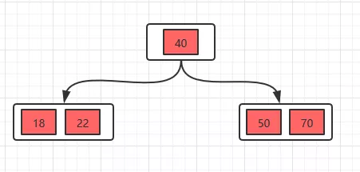
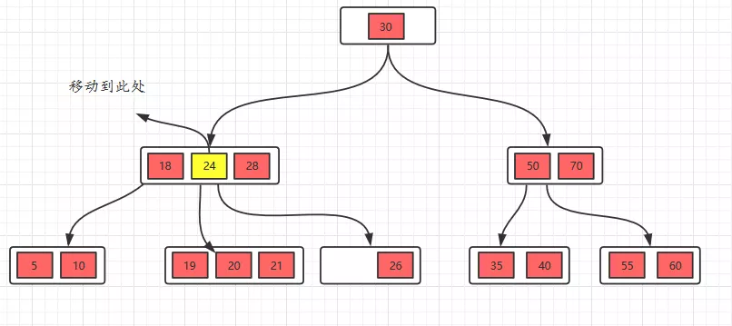
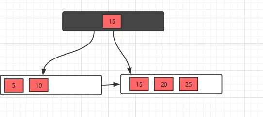
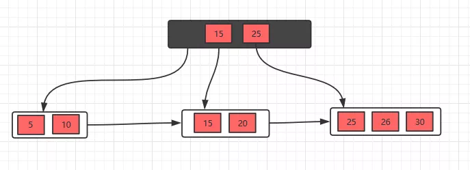
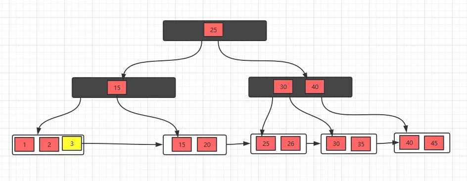

## 1、 B树

　　在介绍B+树之前， 先简单的介绍一下B树，这两种数据结构既有相似之处，也有他们的区别，最后，我们也会对比一下这两种数据结构的区别。

### 1.1 B树概念

B树也称B-树,它是一颗多路平衡查找树。二叉树我想大家都不陌生，其实，B树和后面讲到的B+树也是从最简单的二叉树变换而来的，并没有什么神秘的地方，下面我们来看看B树的定义。
　　（1）每个节点最多有m-1个关键字（可以存有的键值对）。
　　（2）根节点最少可以只有1个关键字。
　　（3）非根节点至少有m/2个关键字。
　　（4）每个节点中的关键字都按照从小到大的顺序排列，每个关键字的左子树中的所有关键字都小于它，而右子树中的所有关键字都大于它。
　　（5）所有叶子节点都位于同一层，或者说根节点到每个叶子节点的长度都相同。
　　（6）每个节点都存有索引和数据，也就是对应的key和value。

所以，根节点的关键字数量范围：1 <= k <= m-1，非根节点的关键字数量范围：m/2 <= k <= m-1。
另外，我们需要注意一个概念，描述一颗B树时需要指定它的阶数，阶数表示了一个节点最多有多少个孩子节点，一般用字母m表示阶数。

我们再举个例子来说明一下上面的概念，比如这里有一个5阶的B树，根节点数量范围：1 <= k <= 4，非根节点数量范围：2 <= k <= 4。
下面，我们通过一个插入的例子，讲解一下B树的插入过程，接着，再讲解一下删除关键字的过程。

### 1.2 B树插入

　　插入的时候，我们需要记住一个规则：判断当前结点key的个数是否小于等于m-1，如果满足，直接插入即可，如果不满足，将节点的中间的key将这个节点分为左右两部分，中间的节点放到父节点中即可。

例子：在5阶B树中，结点最多有4个key,最少有2个key（注意：下面的节点统一用一个节点表示key和value）。

插入18，70，50,40

插入22

插入22时，发现这个节点的关键字已经大于4了，所以需要进行分裂，分裂的规则在上面已经讲了，分裂之后，如下。

接着插入23，25，39

分裂，得到下面的。

更过的插入的过程就不多介绍了，相信有这个例子你已经知道怎么进行插入操作了。

### 1.3 B树的删除操作

　　B树的删除操作相对于插入操作是相对复杂一些的，但是，你知道记住几种情况，一样可以很轻松的掌握的。

现在有一个初始状态是下面这样的B树，然后进行删除操作。

删除15，这种情况是删除叶子节点的元素，如果删除之后，节点数还是大于m/2，这种情况只要直接删除即可。

接着，我们把22删除，这种情况的规则：22是非叶子节点，对于非叶子节点的删除，我们需要用后继key（元素）覆盖要删除的key，然后在后继key所在的子支中删除该后继key。对于删除22，需要将后继元素24移到被删除的22所在的节点。

此时发现26所在的节点只有一个元素，小于2个（m/2），这个节点不符合要求，这时候的规则（向兄弟节点借元素）：如果删除叶子节点，如果删除元素后元素个数少于（m/2），并且它的兄弟节点的元素大于（m/2），也就是说兄弟节点的元素比最少值m/2还多，将先将父节点的元素移到该节点，然后将兄弟节点的元素再移动到父节点。这样就满足要求了。

我们看看操作过程就更加明白了。

接着删除28，删除叶子节点，删除后不满足要求，所以，我们需要考虑向兄弟节点借元素，但是，兄弟节点也没有多的节点（2个），借不了，怎么办呢？如果遇到这种情况，首先，还是将先将父节点的元素移到该节点，然后，将当前节点及它的兄弟节点中的key合并，形成一个新的节点。

移动之后，跟兄弟节点合并。

删除就只有上面的几种情况，根据不同的情况进行删除即可。

上面的这些介绍，相信对于B树已经有一定的了解了，接下来的一部分，我们接着讲解B+树，我相信加上B+树的对比，就更加清晰明了了。

## 2、 B+树

### 2.1 B+树概述

B+树其实和B树是非常相似的，我们首先看看相同点。
　　（1）根节点至少一个元素
　　（2）非根节点元素范围：m/2 <= k <= m-1

不同点：
　　（1）B+树有两种类型的节点：内部结点（也称索引结点）和叶子结点。内部节点就是非叶子节点，内部节点不存储数据，只存储索引，数据都存储在叶子节点。
　　（2）内部结点中的key都按照从小到大的顺序排列，对于内部结点中的一个key，左树中的所有key都小于它，右子树中的key都大于等于它。叶子结点中的记录也按照key的大小排列。
　　（3）每个叶子结点都存有相邻叶子结点的指针，叶子结点本身依关键字的大小自小而大顺序链接。
　　（4）父节点存有右孩子的第一个元素的索引。

下面我们看一个B+树的例子，感受感受它吧！

### 2.2 插入操作

对于插入操作很简单，只需要记住一个技巧即可：当节点元素数量大于m-1的时候，按中间元素分裂成左右两部分，中间元素分裂到父节点当做索引存储，但是，本身中间元素还是分裂右边这一部分的。

下面以一颗5阶B+树的插入过程为例，5阶B+树的节点最少2个元素，最多4个元素。

插入5，10，15，20

插入25，此时元素数量大于4个了，分裂

接着插入26，30，继续分裂

有了这几个例子，相信插入操作没什么问题了，下面接着看看删除操作。

### 2.3 删除操作

对于删除操作是比B树简单一些的，因为叶子节点有指针的存在，向兄弟节点借元素时，不需要通过父节点了，而是可以直接通过兄弟节移动即可（前提是兄弟节点的元素大于m/2），然后更新父节点的索引；如果兄弟节点的元素不大于m/2（兄弟节点也没有多余的元素），则将当前节点和兄弟节点合并，并且删除父节点中的key，下面我们看看具体的实例。

初始状态

删除10，删除后，不满足要求，发现左边兄弟节点有多余的元素，所以去借元素，最后，修改父节点索引

删除元素5，发现不满足要求，并且发现左右兄弟节点都没有多余的元素，所以，可以选择和兄弟节点合并，最后修改父节点索引

发现父节点索引也不满足条件，所以，需要做跟上面一步一样的操作

这样，B+树的删除操作也就完成了，是不是看完之后，觉得非常简单！

## 3 B树和B+树总结

B+树相对于B树有一些自己的优势，可以归结为下面几点：

　（1）单一节点存储的元素更多，使得查询的IO次数更少，所以也就使得它更适合做为数据库MySQL的底层数据结构了。
　（2）所有的查询都要查找到叶子节点，查询性能是稳定的，而B树，每个节点都可以查找到数据，所以不稳定。
　（3）所有的叶子节点形成了一个有序链表，更加便于查找。