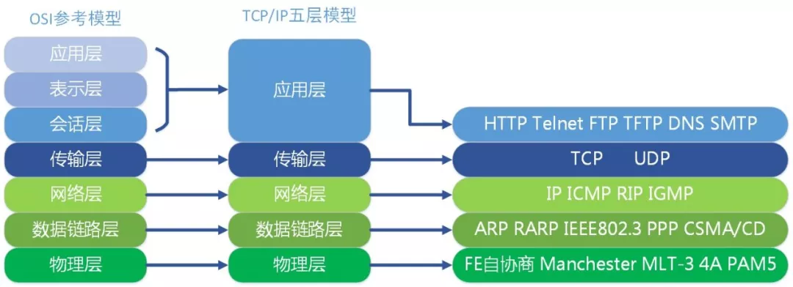
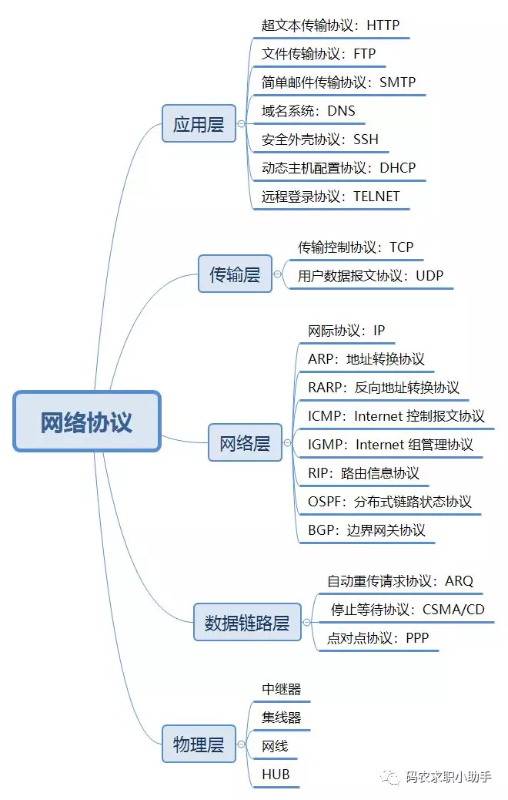
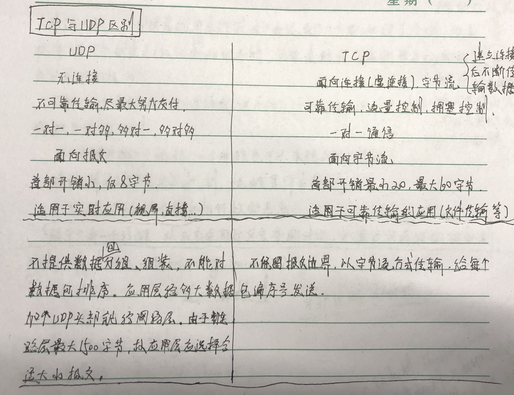
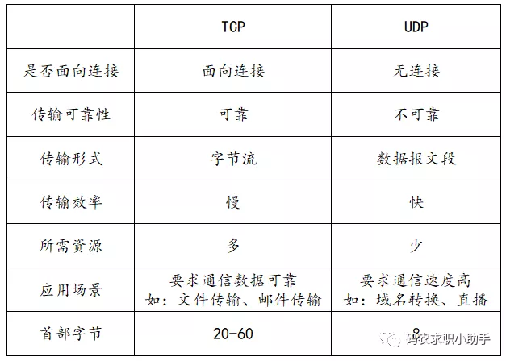
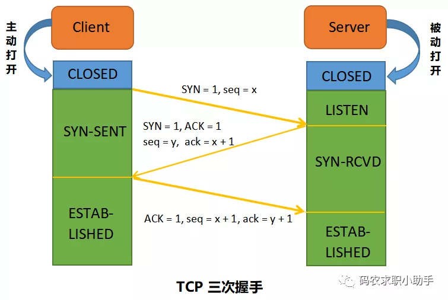
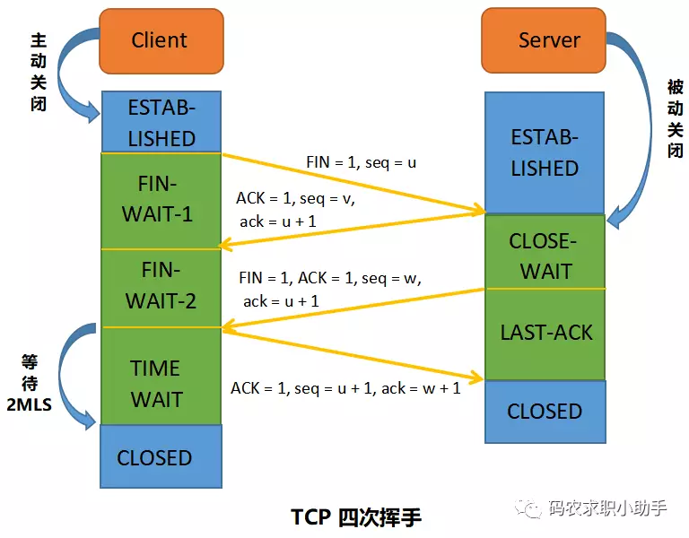
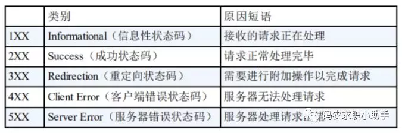

### 1、谈下你对五层网络协议体系结构的理解？

学习计算机网络时我们一般采用折中的办法，也就是中和 OSI 和 TCP/IP 的优点，采用一种只有五层协议的体系结构，这样既简洁又能将概念阐述清楚。

1. 应用层
　　应用层（application-layer）的任务是通过应用进程间的交互来完成特定网络应用。应用层协议定义的是应用进程（进程：主机中正在运行的程序）间的通信和交互的规则。对于不同的网络应用需要不同的应用层协议。在互联网中应用层协议很多，如域名系统 DNS，支持万维网应用的 HTTP 协议，支持电子邮件的 SMTP 协议等等。我们把应用层交互的数据单元称为报文。

2. 运输层
　　运输层（transport layer）的主要任务就是负责向两台主机进程之间的通信提供通用的数据传输服务。应用进程利用该服务传送应用层报文。“通用的”是指并不针对某一个特定的网络应用，而是多种应用可以使用同一个运输层服务。
由于一台主机可同时运行多个线程，因此运输层有复用和分用的功能。所谓复用就是指多个应用层进程可同时使用下面运输层的服务，分用和复用相反，是运输层把收到的信息分别交付上面应用层中的相应进程。

3. 网络层
　　在计算机网络中进行通信的两个计算机之间可能会经过很多个数据链路，也可能还要经过很多通信子网。网络层的任务就是选择合适的网间路由和交换结点， 确保数据及时传送。在发送数据时，网络层把运输层产生的报文段或用户数据报封装成分组和包进行传送。在 TCP / IP 体系结构中，由于网络层使用 IP 协议，因此分组也叫 IP 数据报，简称数据报。

4. 数据链路层
　　数据链路层（data link layer）通常简称为链路层。两台主机之间的数据传输，总是在一段一段的链路上传送的，这就需要使用专门的链路层的协议。在两个相邻节点之间传送数据时，数据链路层将网络层交下来的 IP 数据报组装成帧，在两个相邻节点间的链路上传送帧。每一帧包括数据和必要的控制信息（如：同步信息，地址信息，差错控制等）。
在接收数据时，控制信息使接收端能够知道一个帧从哪个比特开始和到哪个比特结束。这样，数据链路层在收到一个帧后，就可从中提出数据部分，上交给网络层。控制信息还使接收端能够检测到所收到的帧中有无差错。如果发现差错，数据链路层就简单地丢弃这个出了差错的帧，以避免继续在网络中传送下去白白浪费网络资源。如果需要改正数据在链路层传输时出现差错（这就是说，数据链路层不仅要检错，而且还要纠错），那么就要采用可靠性传输协议来纠正出现的差错。这种方法会使链路层的协议复杂些。

5. 物理层
　　在物理层上所传送的数据单位是比特。物理层（physical layer）的作用是实现相邻计算机节点之间比特流的透明传送，尽可能屏蔽掉具体传输介质和物理设备的差异。使其上面的数据链路层不必考虑网络的具体传输介质是什么。“透明传送比特流”表示经实际电路传送后的比特流没有发生变化，对传送的比特流来说，这个电路好像是看不见的。

### 2、简单说下每一层对应的网络协议有哪些？

计算机五层网络体系中涉及的协议非常多，下面就常用的做了列举：

### 3、ARP 协议的工作原理？
　　网络层的 ARP 协议完成了 IP 地址与物理地址的映射。首先，每台主机都会在自己的 ARP 缓冲区中建立一个 ARP 列表，以表示 IP 地址和 MAC 地址的对应关系。当源主机需要将一个数据包要发送到目的主机时，会首先检查自己 ARP 列表中是否存在该 IP 地址对应的 MAC 地址：如果有，就直接将数据包发送到这个 MAC 地址；如果没有，就向本地网段发起一个 ARP 请求的广播包，查询此目的主机对应的 MAC 地址。

此 ARP 请求数据包里包括源主机的 IP 地址、硬件地址、以及目的主机的 IP 地址。网络中所有的主机收到这个 ARP 请求后，会检查数据包中的目的 IP 是否和自己的 IP 地址一致。如果不相同就忽略此数据包；如果相同，该主机首先将发送端的 MAC 地址和 IP 地址添加到自己的 ARP 列表中，如果 ARP 表中已经存在该 IP 的信息，则将其覆盖，然后给源主机发送一个 ARP 响应数据包，告诉对方自己是它需要查找的 MAC 地址；源主机收到这个 ARP 响应数据包后，将得到的目的主机的 IP 地址和 MAC 地址添加到自己的 ARP 列表中，并利用此信息开始数据的传输。如果源主机一直没有收到 ARP 响应数据包，表示 ARP 查询失败。

### 4、谈下你对 IP 地址分类的理解？
　　IP 地址是指互联网协议地址，是 IP 协议提供的一种统一的地址格式，它为互联网上的每一个网络和每一台主机分配一个逻辑地址，以此来屏蔽物理地址的差异。IP 地址编址方案将 IP 地址空间划分为 A、B、C、D、E 五类，其中 A、B、C 是基本类，D、E 类作为多播和保留使用，为特殊地址。

每个 IP 地址包括两个标识码（ID），即网络 ID 和主机 ID。同一个物理网络上的所有主机都使用同一个网络 ID，网络上的一个主机（包括网络上工作站，服务器和路由器等）有一个主机 ID 与其对应。A~E 类地址的特点如下：

　　A 类地址：以 0 开头，第一个字节范围：0~127；
　　B 类地址：以 10 开头，第一个字节范围：128~191；
　　C 类地址：以 110 开头，第一个字节范围：192~223；
　　D 类地址：以 1110 开头，第一个字节范围为 224~239；
　　E 类地址：以 1111 开头，保留地址

### 5、TCP 与 UDP 的主要特点是什么？

#### 5.1 TCP 的主要特点

　　1. TCP 是面向连接的。（就好像打电话一样，通话前需要先拨号建立连接，通话结束后要挂机释放连接）；
　　2. 每一条 TCP 连接只能有两个端点，每一条 TCP 连接只能是点对点的（一对一）；
　　3. TCP 提供可靠交付的服务。通过 TCP 连接传送的数据，无差错、不丢失、不重复、并且按序到达；
　　4. TCP 提供全双工通信。TCP 允许通信双方的应用进程在任何时候都能发送数据。TCP 连接的两端都设有发送缓存和接收缓存，用来临时存放双方通信的数据；
　　5. 面向字节流。TCP 中的“流”（Stream）指的是流入进程或从进程流出的字节序列。“面向字节流”的含义是：虽然应用程序和 TCP 的交互是一次一个数据块（大小不等），但 TCP 把应用程序交下来的数据仅仅看成是一连串的无结构的字节流。

#### 5.2 UDP 的主要特点

　　1. UDP 是无连接的；
　　2. UDP 使用尽最大努力交付，即不保证可靠交付，因此主机不需要维持复杂的链接状态（这里面有许多参数）；
　　3. UDP 是面向报文的；
　　4. UDP 没有拥塞控制，因此网络出现拥塞不会使源主机的发送速率降低（对实时应用很有用，如 直播，实时视频会议等）；
　　5. UDP 支持一对一、一对多、多对一和多对多的交互通信；
　　6. UDP 的首部开销小，只有 8 个字节，比 TCP 的 20 个字节的首部要短。

### 6、TCP 和 UDP 的区别？

　　TCP 提供面向连接的服务。在传送数据之前必须先建立连接，数据传送结束后要释放连接。TCP 不提供广播或多播服务。由于 TCP 要提供可靠的，面向连接的运输服务（TCP 的可靠体现在 TCP 在传递数据之前，会有三次握手来建立连接，而且在数据传递时，有确认、窗口、重传、拥塞控制机制，在数据传完后，还会断开连接用来节约系统资源），这难以避免增加了许多开销，如确认，流量控制，计时器以及连接管理等。这不仅使协议数据单元的首部增大很多，还要占用许多处理机资源。
 UDP 在传送数据之前不需要先建立连接，远地主机在收到 UDP 报文后，不需要给出任何确认。虽然 UDP 不提供可靠交付，但在某些情况下 UDP 确是一种最有效的工作方式（一般用于即时通信），比如：QQ 语音、 QQ 视频 、直播等等。

### 7、TCP 和 UDP 分别对应的常见应用层协议有哪些？

#### 7.1. TCP 对应的应用层协议

**FTP：** 定义了文件传输协议，使用 21 端口。常说某某计算机开了 FTP 服务便是启动了文件传输服务。下载文件，上传主页，都要用到 FTP 服务。

**Telnet：** 它是一种用于远程登陆的端口，用户可以以自己的身份远程连接到计算机上，通过这种端口可以提供一种基于 DOS 模式下的通信服务。如以前的 BBS 是-纯字符界面的，支持 BBS 的服务器将 23 端口打开，对外提供服务。

**SMTP：** 定义了简单邮件传送协议，现在很多邮件服务器都用的是这个协议，用于发送邮件。如常见的免费邮件服务中用的就是这个邮件服务端口，所以在电子邮件设置-中常看到有这么 SMTP 端口设置这个栏，服务器开放的是 25 号端口。

**POP3：** 它是和 SMTP 对应，POP3 用于接收邮件。通常情况下，POP3 协议所用的是 110 端口。也是说，只要你有相应的使用 POP3 协议的程序（例如 Fo-xmail 或 Outlook），就可以不以 Web 方式登陆进邮箱界面，直接用邮件程序就可以收到邮件（如是163 邮箱就没有必要先进入网易网站，再进入自己的邮-箱来收信）。

**HTTP：** 从 Web 服务器传输超文本到本地浏览器的传送协议。

#### 7.2. UDP 对应的应用层协议

**DNS：** 用于域名解析服务，将域名地址转换为 IP 地址。DNS 用的是 53 号端口。

**SNMP：** 简单网络管理协议，使用 161 号端口，是用来管理网络设备的。由于网络设备很多，无连接的服务就体现出其优势。

**TFTP(Trival File Transfer Protocal)：** 简单文件传输协议，该协议在熟知端口 69 上使用 UDP 服务。

### 8、详细说下 TCP 三次握手的过程？

#### 8.1. 三次握手

TCP 建立连接的过程叫做握手，握手需要在客户和服务器之间交换三个 TCP 报文段。

最初客户端和服务端都处于 CLOSED(关闭) 状态。本例中 A（Client） 主动打开连接，B（Server） 被动打开连接。

一开始，B 的 TCP 服务器进程首先创建传输控制块TCB，准备接受客户端进程的连接请求。然后服务端进程就处于 LISTEN(监听) 状态，等待客户端的连接请求。如有，立即作出响应。

第一次握手：A 的 TCP 客户端进程也是首先创建传输控制块 TCB。然后，在打算建立 TCP 连接时，向 B 发出连接请求报文段，这时首部中的同步位 SYN=1，同时选择一个初始序号 seq = x。TCP 规定，SYN 报文段（即 SYN = 1 的报文段）不能携带数据，但要消耗掉一个序号。这时，TCP 客户进程进入 SYN-SENT（同步已发送）状态。

第二次握手：B 收到连接请求报文后，如果同意建立连接，则向 A 发送确认。在确认报文段中应把 SYN 位和 ACK 位都置 1，确认号是 ack = x + 1，同时也为自己选择一个初始序号 seq = y。请注意，这个报文段也不能携带数据，但同样要消耗掉一个序号。这时 TCP 服务端进程进入 SYN-RCVD（同步收到）状态。

第三次握手：TCP 客户进程收到 B 的确认后，还要向 B 给出确认。确认报文段的 ACK 置 1，确认号 ack = y +  1，而自己的序号 seq = x + 1。这时 ACK 报文段可以携带数据。但如果不携带数据则不消耗序号，这种情况下，下一个数据报文段的序号仍是 seq = x + 1。这时，TCP 连接已经建立，A 进入 ESTABLISHED（已建立连接）状态。

#### 8.2 为什么两次握手不可以呢？
为了防止已经失效的连接请求报文段突然又传送到了 B，因而产生错误。比如下面这种情况：A 发出的第一个连接请求报文段并没有丢失，而是在网路结点长时间滞留了，以致于延误到连接释放以后的某个时间段才到达 B。本来这是一个早已失效的报文段。但是 B 收到此失效的链接请求报文段后，就误认为 A 又发出一次新的连接请求。于是就向 A 发出确认报文段，同意建立连接。
对于上面这种情况，如果不进行第三次握手，B 发出确认后就认为新的运输连接已经建立了，并一直等待 A 发来数据。B 的许多资源就这样白白浪费了。
如果采用了三次握手，由于 A 实际上并没有发出建立连接请求，所以不会理睬 B 的确认，也不会向 B 发送数据。B 由于收不到确认，就知道 A 并没有要求建立连接。

#### 8.3 为什么不需要四次握手？
有人可能会说 A 发出第三次握手的信息后在没有接收到 B 的请求就已经进入了连接状态，那如果 A 的这个确认包丢失或者滞留了怎么办？

我们需要明白一点，完全可靠的通信协议是不存在的。在经过三次握手之后，客户端和服务端已经可以确认之前的通信状况，都收到了确认信息。所以即便再增加握手次数也不能保证后面的通信完全可靠，所以是没有必要的。

#### 8.4 Server 端收到 Client 端的 SYN 后，为什么还要传回 SYN？
接收端传回发送端所发送的 SYN 是为了告诉发送端，我接收到的信息确实就是你所发送的信号了。

SYN 是 TCP / IP 建立连接时使用的握手信号。在客户机和服务器之间建立正常的 TCP 网络连接时，客户机首先发出一个 SYN 消息，服务器使用 SYN-ACK 应答表示接收到了这个消息，最后客户机再以 ACK(Acknowledgement[汉译：确认字符，在数据通信传输中，接收站发给发送站的一种传输控制字符。它表示确认发来的数据已经接受无误]）消息响应。这样在客户机和服务器之间才能建立起可靠的 TCP 连接，数据才可以在客户机和服务器之间传递。

#### 8.5 传了 SYN，为什么还要传 ACK？
双方通信无误必须是两者互相发送信息都无误。传了 SYN，证明发送方到接收方的通道没有问题，但是接收方到发送方的通道还需要 ACK 信号来进行验证。

### 9、详细说下 TCP 四次挥手的过程？

#### 9.1 四次挥手

据传输结束后，通信的双方都可以释放连接。现在 A 和 B 都处于 ESTABLISHED 状态。

第一次挥手：A 的应用进程先向其 TCP 发出连接释放报文段，并停止再发送数据，主动关闭 TCP 连接。A 把连接释放报文段首部的终止控制位 FIN 置 1，其序号 seq = u（等于前面已传送过的数据的最后一个字节的序号加 1），这时 A 进入 FIN-WAIT-1（终止等待1）状态，等待 B 的确认。请注意：TCP 规定，FIN 报文段即使不携带数据，也将消耗掉一个序号。

第二次挥手：B 收到连接释放报文段后立即发出确认，确认号是 ack = u + 1，而这个报文段自己的序号是 v（等于 B 前面已经传送过的数据的最后一个字节的序号加1），然后 B 就进入 CLOSE-WAIT（关闭等待）状态。TCP 服务端进程这时应通知高层应用进程，因而从 A 到 B 这个方向的连接就释放了，这时的 TCP 连接处于半关闭（half-close）状态，即 A 已经没有数据要发送了，但 B 若发送数据，A 仍要接收。也就是说，从 B 到 A 这个方向的连接并未关闭，这个状态可能会持续一段时间。A 收到来自 B 的确认后，就进入 FIN-WAIT-2(终止等待2)状态，等待 B 发出的连接释放报文段。

第三次挥手：若 B 已经没有要向 A 发送的数据，其应用进程就通知 TCP 释放连接。这时 B 发出的连接释放报文段必须使 FIN = 1。假定 B 的序号为 w（在半关闭状态，B 可能又发送了一些数据）。B 还必须重复上次已发送过的确认号 ack = u + 1。这时 B 就进入 LAST-ACK(最后确认)状态，等待 A 的确认。

第四次挥手：A 在收到 B 的连接释放报文后，必须对此发出确认。在确认报文段中把 ACK 置 1，确认号 ack = w + 1，而自己的序号 seq = u + 1（前面发送的 FIN 报文段要消耗一个序号）。然后进入 TIME-WAIT(时间等待) 状态。请注意，现在 TCP 连接还没有释放掉。必须经过时间等待计时器设置的时间 2MSL（MSL：最长报文段寿命）后，A 才能进入到 CLOSED 状态，然后撤销传输控制块，结束这次 TCP 连接。当然如果 B 一收到 A 的确认就进入 CLOSED 状态，然后撤销传输控制块。所以在释放连接时，B 结束 TCP 连接的时间要早于 A。

#### 9.2 为什么 TIME-WAIT 状态必须等待 2MSL 的时间呢？
1. 为了保证 A 发送的最后一个 ACK 报文段能够到达 B。这个 ACK 报文段有可能丢失，因而使处在 LAST-ACK 状态的 B 收不到对已发送的 FIN + ACK 报文段的确认。B 会超时重传这个 FIN+ACK 报文段，而 A 就能在 2MSL 时间内（超时 + 1MSL 传输）收到这个重传的 FIN+ACK 报文段。接着 A 重传一次确认，重新启动 2MSL 计时器。最后，A 和 B 都正常进入到 CLOSED 状态。如果 A 在 TIME-WAIT 状态不等待一段时间，而是在发送完 ACK 报文段后立即释放连接，那么就无法收到 B 重传的 FIN + ACK 报文段，因而也不会再发送一次确认报文段，这样，B 就无法按照正常步骤进入 CLOSED 状态。
2. 防止已失效的连接请求报文段出现在本连接中。A 在发送完最后一个 ACK 报文段后，再经过时间 2MSL，就可以使本连接持续的时间内所产生的所有报文段都从网络中消失。这样就可以使下一个连接中不会出现这种旧的连接请求报文段。

#### 9.5 为什么第二次跟第三次不能合并, 第二次和第三次之间的等待是什么?
当服务器执行第二次挥手之后, 此时证明客户端不会再向服务端请求任何数据, 但是服务端可能还正在给客户端发送数据（可能是客户端上一次请求的资源还没有发送完毕），所以此时服务端会等待把之前未传输完的数据传输完毕之后再发送关闭请求。

#### 9.6 保活计时器的作用？
除时间等待计时器外，TCP 还有一个保活计时器（keepalive  timer）。设想这样的场景：客户已主动与服务器建立了 TCP 连接。但后来客户端的主机突然发生故障。显然，服务器以后就不能再收到客户端发来的数据。因此，应当有措施使服务器不要再白白等待下去。这就需要使用保活计时器了。

服务器每收到一次客户的数据，就重新设置保活计时器，时间的设置通常是两个小时。若两个小时都没有收到客户端的数据，服务端就发送一个探测报文段，以后则每隔  75 秒钟发送一次。若连续发送 10个 探测报文段后仍然无客户端的响应，服务端就认为客户端出了故障，接着就关闭这个连接。

### 10、TCP 协议是如何保证可靠传输的？

1. 数据包校验：目的是检测数据在传输过程中的任何变化，若校验出包有错，则丢弃报文段并且不给出响应，这时 TCP 发送数据端超时后会重发数据；
2. 对失序数据包重排序：既然 TCP 报文段作为 IP 数据报来传输，而 IP 数据报的到达可能会失序，因此 TCP 报文段的到达也可能会失序。TCP 将对失序数据进行重新排序，然后才交给应用层；
3. 丢弃重复数据：对于重复数据，能够丢弃重复数据；
4. 应答机制：当 TCP 收到发自 TCP 连接另一端的数据，它将发送一个确认。这个确认不是立即发送，通常将推迟几分之一秒；
5. 超时重发：当 TCP 发出一个段后，它启动一个定时器，等待目的端确认收到这个报文段。如果不能及时收到一个确认，将重发这个报文段；
6. 流量控制：TCP 连接的每一方都有固定大小的缓冲空间。TCP 的接收端只允许另一端发送接收端缓冲区所能接纳的数据，这可以防止较快主机致使较慢主机的缓冲区溢出，这就是流量控制。TCP 使用的流量控制协议是可变大小的滑动窗口协议。

3
### 11、谈谈你对停止等待协议的理解？

停止等待协议是为了实现可靠传输的，它的基本原理就是每发完一个分组就停止发送，等待对方确认。在收到确认后再发下一个分组；在停止等待协议中，若接收方收到重复分组，就丢弃该分组，但同时还要发送确认。主要包括以下几种情况：无差错情况、出现差错情况（超时重传）、确认丢失和确认迟到、确认丢失和确认迟到。

### 12、谈谈你对 ARQ 协议的理解？

自动重传请求 ARQ 协议

　　停止等待协议中超时重传是指只要超过一段时间仍然没有收到确认，就重传前面发送过的分组（认为刚才发送过的分组丢失了）。因此每发送完一个分组需要设置一个超时计时器，其重传时间应比数据在分组传输的平均往返时间更长一些。这种自动重传方式常称为自动重传请求 ARQ。

连续 ARQ 协议

　　连续 ARQ 协议可提高信道利用率。发送方维持一个发送窗口，凡位于发送窗口内的分组可以连续发送出去，而不需要等待对方确认。接收方一般采用累计确认，对按序到达的最后一个分组发送确认，表明到这个分组为止的所有分组都已经正确收到了。

### 13、谈谈你对滑动窗口的了解？

　　TCP 利用滑动窗口实现流量控制的机制。滑动窗口（Sliding window）是一种流量控制技术。早期的网络通信中，通信双方不会考虑网络的拥挤情况直接发送数据。由于大家不知道网络拥塞状况，同时发送数据，导致中间节点阻塞掉包，谁也发不了数据，所以就有了滑动窗口机制来解决此问题。

　　TCP 中采用滑动窗口来进行传输控制，滑动窗口的大小意味着接收方还有多大的缓冲区可以用于接收数据。发送方可以通过滑动窗口的大小来确定应该发送多少字节的数据。当滑动窗口为 0 时，发送方一般不能再发送数据报，但有两种情况除外，一种情况是可以发送紧急数据，例如，允许用户终止在远端机上的运行进程。另一种情况是发送方可以发送一个 1 字节的数据报来通知接收方重新声明它希望接收的下一字节及发送方的滑动窗口大小。

### 14、谈下你对流量控制的理解？
TCP 利用滑动窗口实现流量控制。流量控制是为了控制发送方发送速率，保证接收方来得及接收。接收方发送的确认报文中的窗口字段可以用来控制发送方窗口大小，从而影响发送方的发送速率。将窗口字段设置为 0，则发送方不能发送数据。

### 15、谈下你对 TCP 拥塞控制的理解？使用了哪些算法？

　　拥塞控制和流量控制不同，前者是一个全局性的过程，而后者指点对点通信量的控制。在某段时间，若对网络中某一资源的需求超过了该资源所能提供的可用部分，网络的性能就要变坏。这种情况就叫拥塞。

　　拥塞控制就是为了防止过多的数据注入到网络中，这样就可以使网络中的路由器或链路不致于过载。拥塞控制所要做的都有一个前提，就是网络能够承受现有的网络负荷。拥塞控制是一个全局性的过程，涉及到所有的主机，所有的路由器，以及与降低网络传输性能有关的所有因素。相反，流量控制往往是点对点通信量的控制，是个端到端的问题。流量控制所要做到的就是抑制发送端发送数据的速率，以便使接收端来得及接收。

　　为了进行拥塞控制，TCP 发送方要维持一个拥塞窗口(cwnd) 的状态变量。拥塞控制窗口的大小取决于网络的拥塞程度，并且动态变化。发送方让自己的发送窗口取为拥塞窗口和接收方的接受窗口中较小的一个。

　　TCP 的拥塞控制采用了四种算法，即：慢开始、拥塞避免、快重传和快恢复。在网络层也可以使路由器采用适当的分组丢弃策略（如：主动队列管理 AQM），以减少网络拥塞的发生。

慢开始： 

　　慢开始算法的思路是当主机开始发送数据时，如果立即把大量数据字节注入到网络，那么可能会引起网络阻塞，因为现在还不知道网络的符合情况。经验表明，较好的方法是先探测一下，即由小到大逐渐增大发送窗口，也就是由小到大逐渐增大拥塞窗口数值。cwnd 初始值为 1，每经过一个传播轮次，cwnd 加倍。

拥塞避免： 

　　拥塞避免算法的思路是让拥塞窗口 cwnd 缓慢增大，即每经过一个往返时间 RTT 就把发送方的 cwnd 加 1。

快重传与快恢复： 

　　在 TCP/IP 中，快速重传和快恢复（fast retransmit and recovery，FRR）是一种拥塞控制算法，它能快速恢复丢失的数据包。

没有 FRR，如果数据包丢失了，TCP 将会使用定时器来要求传输暂停。在暂停的这段时间内，没有新的或复制的数据包被发送。有了 FRR，如果接收机接收到一个不按顺序的数据段，它会立即给发送机发送一个重复确认。如果发送机接收到三个重复确认，它会假定确认件指出的数据段丢失了，并立即重传这些丢失的数据段。

有了 FRR，就不会因为重传时要求的暂停被耽误。当有单独的数据包丢失时，快速重传和快恢复（FRR）能最有效地工作。当有多个数据信息包在某一段很短的时间内丢失时，它则不能很有效地工作。

### 16、粘包

#### 16.1 什么是粘包？
在进行 Java NIO 学习时，可能会发现：如果客户端连续不断的向服务端发送数据包时，服务端接收的数据会出现两个数据包粘在一起的情况。

1. TCP 是基于字节流的，虽然应用层和 TCP 传输层之间的数据交互是大小不等的数据块，但是 TCP 把这些数据块仅仅看成一连串无结构的字节流，没有边界；
2. 从 TCP 的帧结构也可以看出，在 TCP 的首部没有表示数据长度的字段。
基于上面两点，在使用 TCP 传输数据时，才有粘包或者拆包现象发生的可能。一个数据包中包含了发送端发送的两个数据包的信息，这种现象即为粘包。

接收端收到了两个数据包，但是这两个数据包要么是不完整的，要么就是多出来一块，这种情况即发生了拆包和粘包。拆包和粘包的问题导致接收端在处理的时候会非常困难，因为无法区分一个完整的数据包。

#### 16.2 TCP 黏包是怎么产生的？

发送方产生粘包
采用 TCP 协议传输数据的客户端与服务器经常是保持一个长连接的状态（一次连接发一次数据不存在粘包），双方在连接不断开的情况下，可以一直传输数据。但当发送的数据包过于的小时，那么 TCP 协议默认的会启用 Nagle 算法，将这些较小的数据包进行合并发送（缓冲区数据发送是一个堆压的过程）；这个合并过程就是在发送缓冲区中进行的，也就是说数据发送出来它已经是粘包的状态了。
接收方产生粘包
接收方采用 TCP 协议接收数据时的过程是这样的：数据到接收方，从网络模型的下方传递至传输层，传输层的 TCP 协议处理是将其放置接收缓冲区，然后由应用层来主动获取（C 语言用 recv、read 等函数）；这时会出现一个问题，就是我们在程序中调用的读取数据函数不能及时的把缓冲区中的数据拿出来，而下一个数据又到来并有一部分放入的缓冲区末尾，等我们读取数据时就是一个粘包。（放数据的速度 > 应用层拿数据速度）

#### 16.3 怎么解决拆包和粘包？

分包机制一般有两个通用的解决方法：

1. 特殊字符控制；
2. 在包头首都添加数据包的长度。
如果使用 netty 的话，就有专门的编码器和解码器解决拆包和粘包问题了。
tips：UDP 没有粘包问题，但是有丢包和乱序。不完整的包是不会有的，收到的都是完全正确的包。传送的数据单位协议是 UDP 报文或用户数据报，发送的时候既不合并，也不拆分。

### 17、你对 HTTP 状态码有了解吗？

#### 1XX 信息
　　100 Continue ：表明到目前为止都很正常，客户端可以继续发送请求或者忽略这个响应。

#### 2XX 成功
　　200 OK
　　204 No Content ：请求已经成功处理，但是返回的响应报文不包含实体的主体部分。一般在只需要从客户端往服务器发送信息，而不需要返回数据时使用。
　　206 Partial Content ：表示客户端进行了范围请求，响应报文包含由 Content-Range 指定范围的实体内容。

#### 3XX 重定向
　　301 Moved Permanently ：永久性重定向；
　　302 Found ：临时性重定向；
　　303 See Other ：去查看其他地址，只能用get,post
　　304 Not Modified ：未修改，使用缓存资源
　　307 Temporary Redirect ：临时重定向，与 302 的含义类似，但是 307 要求浏览器不会把重定向请求的 POST 方法改成 GET 方法。

#### 4XX 客户端错误
　　400 Bad Request ：请求报文中存在语法错误。
　　401 Unauthorized ：该状态码表示发送的请求需要有认证信息（BASIC 认证、DIGEST 认证）。如果之前已进行过一次请求，则表示用户认证失败。
　　403 Forbidden ：请求被拒绝。
　　404 Not Found ：资源未找到
　　404 ：请求方法被禁止

#### 5XX 服务器错误
　　500 Internal Server Error ：服务器正在执行请求时发生错误；
　　501 ：服务器不支持请求功能
　　503 Service Unavailable ：服务器暂时处于超负载或正在进行停机维护，现在无法处理请求。

#### HTTP 状态码 301 和 302 代表的是什么？有什么区别？还有307？

　　301，302，307 都是 HTTP 状态的编码，都代表着某个 URL 发生了转移。

区别： 
　　301 redirect: 301 代表永久性转移（Permanently Moved）
　　302 redirect: 302 代表暂时性转移（Temporarily Moved）
　　307 redirect：307 代表临时重定向，使用GET方法

### 18、forward 和 redirect 的区别？

Forward 和 Redirect 代表了两种请求转发方式：直接转发和间接转发。

直接转发方式（Forward）：客户端和浏览器只发出一次请求，Servlet、HTML、JSP 或其它信息资源，由第二个信息资源响应该请求，在请求对象 request 中，保存的对象对于每个信息资源是共享的。
间接转发方式（Redirect）：实际是两次 HTTP 请求，服务器端在响应第一次请求的时候，让浏览器再向另外一个 URL 发出请求，从而达到转发的目的。

**举个通俗的例子：**

直接转发就相当于：“A 找 B 借钱，B 说没有，B 去找 C 借，借到借不到都会把消息传递给 A”；
间接转发就相当于："A 找 B 借钱，B 说没有，让 A 去找 C 借"。

### 19、HTTP 方法有哪些？

客户端发送的 请求报文 第一行为请求行，包含了方法字段。

　　1. GET：获取资源，当前网络中绝大部分使用的都是 GET；
　　2. HEAD：获取报文首部，和 GET 方法类似，但是不返回报文实体主体部分；
　　3. POST：传输实体主体
　　4. PUT：上传文件，由于自身不带验证机制，任何人都可以上传文件，因此存在安全性问题，一般不使用该方法。
　　5. PATCH：对资源进行部分修改。PUT 也可以用于修改资源，但是只能完全替代原始资源，PATCH 允许部分修改。
　　6. OPTIONS：查询指定的 URL 支持的方法；
　　7. CONNECT：要求在与代理服务器通信时建立隧道。使用 SSL（Secure Sockets Layer，安全套接层）和 TLS（Transport Layer Security，传输层安全）协议把通信内容加密后经网络隧道传输。
　　8. TRACE：追踪路径。服务器会将通信路径返回给客户端。发送请求时，在 Max-Forwards 首部字段中填入数值，每经过一个服务器就会减 1，当数值为 0 时就停止传输。通常不会使用 TRACE，并且它容易受到 XST 攻击（Cross-Site Tracing，跨站追踪）。

#### 19.1 说下 GET 和 POST 的区别？

GET 和 POST 本质都是 HTTP 请求，只不过对它们的作用做了界定和适配，并且让他们适应各自的场景。

本质区别：GET 只是一次 HTTP请求，POST 先发请求头再发请求体，实际上是两次请求。（这个情况不一定，也视浏览器而定）

　　1. 从功能上讲，GET 一般用来从服务器上获取资源，POST 一般用来更新服务器上的资源；
　　2. 从 REST 服务角度上说，GET 是幂等的，即读取同一个资源，总是得到相同的数据，而 POST 不是幂等的，因为每次请求对资源的改变并不是相同的；进一步地，GET 不会改变服务器上的资源，而 POST 会对服务器资源进行改变；
　　3. 从请求参数形式上看，GET 请求的数据会附在 URL 之后，即将请求数据放置在 HTTP 报文的 请求头 中，以 ? 分割 URL 和传输数据，参数之间以 & 相连。特别地，如果数据是英文字母/数字，原样发送；否则，会将其编码为 application/x-www-form-urlencoded MIME 字符串(如果是空格，转换为+，如果是中文/其他字符，则直接把字符串用 BASE64 加密，得出如：%E4%BD%A0%E5%A5%BD，其中 ％XX 中的 XX 为该符号以 16 进制表示的 ASCII)；而 POST 请求会把提交的数据则放置在是 HTTP 请求报文的 请求体 中；
　　4. 就安全性而言，POST 的安全性要比 GET 的安全性高，因为 GET 请求提交的数据将明文出现在 URL 上，而且 POST 请求参数则被包装到请求体中，相对更安全；
　　5. 从请求的大小看，GET 请求的长度受限于浏览器或服务器对 URL 长度的限制，允许发送的数据量比较小，而 POST 请求则是没有大小限制的。

### 20、在浏览器中输入 URL 地址到显示主页的过程？

1. DNS 解析：浏览器查询 DNS，获取域名对应的 IP 地址：具体过程包括浏览器搜索自身的 DNS 缓存、搜索操作系统的 DNS 缓存、读取本地的 Host 文件和向本地 DNS 服务器进行查询等。对于向本地 DNS 服务器进行查询，如果要查询的域名包含在本地配置区域资源中，则返回解析结果给客户机，完成域名解析(此解析具有权威性)；如果要查询的域名不由本地 DNS 服务器区域解析，但该服务器已缓存了此网址映射关系，则调用这个 IP 地址映射，完成域名解析（此解析不具有权威性）。如果本地域名服务器并未缓存该网址映射关系，那么将根据其设置发起递归查询或者迭代查询；

2. TCP 连接：浏览器获得域名对应的 IP 地址以后，浏览器向服务器请求建立链接，发起三次握手；

3. 发送 HTTP 请求：TCP 连接建立起来后，浏览器向服务器发送 HTTP 请求；

4. 服务器处理请求并返回 HTTP 报文：服务器接收到这个请求，并根据路径参数映射到特定的请求处理器进行处理，并将处理结果及相应的视图返回给浏览器；

5. 浏览器解析渲染页面：浏览器解析并渲染视图，若遇到对 js 文件、css 文件及图片等静态资源的引用，则重复上述步骤并向服务器请求这些资源；浏览器根据其请求到的资源、数据渲染页面，最终向用户呈现一个完整的页面。

6. 连接结束。

### 21、DNS 的解析过程？

1. 主机向本地域名服务器的查询一般都是采用递归查询。所谓递归查询就是：如果主机所询问的本地域名服务器不知道被查询的域名的 IP 地址，那么本地域名服务器就以 DNS 客户的身份，向根域名服务器继续发出查询请求报文(即替主机继续查询)，而不是让主机自己进行下一步查询。因此，递归查询返回的查询结果或者是所要查询的 IP 地址，或者是报错，表示无法查询到所需的 IP 地址。

2. 本地域名服务器向根域名服务器的查询的迭代查询。迭代查询的特点：当根域名服务器收到本地域名服务器发出的迭代查询请求报文时，要么给出所要查询的 IP 地址，要么告诉本地服务器：“你下一步应当向哪一个域名服务器进行查询”。然后让本地服务器进行后续的查询。根域名服务器通常是把自己知道的顶级域名服务器的 IP 地址告诉本地域名服务器，让本地域名服务器再向顶级域名服务器查询。顶级域名服务器在收到本地域名服务器的查询请求后，要么给出所要查询的 IP 地址，要么告诉本地服务器下一步应当向哪一个权限域名服务器进行查询。最后，本地域名服务器得到了所要解析的 IP 地址或报错，然后把这个结果返回给发起查询的主机。

### 22、谈谈你对域名缓存的了解？

　　为了提高 DNS 查询效率，并减轻服务器的负荷和减少因特网上的 DNS 查询报文数量，在域名服务器中广泛使用了高速缓存，用来存放最近查询过的域名以及从何处获得域名映射信息的记录。

　　由于名字到地址的绑定并不经常改变，为保持高速缓存中的内容正确，域名服务器应为每项内容设置计时器并处理超过合理时间的项（例如：每个项目两天）。当域名服务器已从缓存中删去某项信息后又被请求查询该项信息，就必须重新到授权管理该项的域名服务器绑定信息。当权限服务器回答一个查询请求时，在响应中都指明绑定有效存在的时间值。增加此时间值可减少网络开销，而减少此时间值可提高域名解析的正确性。

　　不仅在本地域名服务器中需要高速缓存，在主机中也需要。许多主机在启动时从本地服务器下载名字和地址的全部数据库，维护存放自己最近使用的域名的高速缓存，并且只在从缓存中找不到名字时才使用域名服务器。维护本地域名服务器数据库的主机应当定期地检查域名服务器以获取新的映射信息，而且主机必须从缓存中删除无效的项。由于域名改动并不频繁，大多数网点不需花精力就能维护数据库的一致性。

### 23、HTTP请求与响应

#### HTTP请求

　　状态行：请求方法、资源路径URL、协议版本
　　请求头：用户代理、主机地址、连接方式(长连接/短链接)、cookie、Accept等
　　请求正文：

#### HTTP响应

　　状态行：协议版本、状态码、回应短语
　　响应头：发送时间、数据格式、数据长度等
　　响应正文：

#### HTTP响应模型：

　　单进程IO模型：单进程处理请求，顺序处理
　　多进程IO模型：多进程处理请求
　　复用IO模型：单进程，多线程并发执行处理请求
　　复用多线程IO模型：多进程 + 多线程处理请求

### 23、谈下你对 HTTP 长连接和短连接的理解？分别应用于哪些场景？

　　在 HTTP/1.0 中默认使用短连接。也就是说，客户端和服务器每进行一次 HTTP 操作，就建立一次连接，任务结束就中断连接。当客户端浏览器访问的某个 HTML 或其他类型的 Web 页中包含有其他的 Web 资源（如：JavaScript 文件、图像文件、CSS 文件等），每遇到这样一个 Web 资源，浏览器就会重新建立一个 HTTP 会话。

　　而从 HTTP/1.1 起，默认使用长连接，用以保持连接特性。使用长连接的 HTTP 协议，会在响应头加入这行代码：

**长连接：** Connection:keep-alive

　　在使用长连接的情况下，当一个网页打开完成后，客户端和服务器之间用于传输 HTTP 数据的 TCP 连接不会关闭，客户端再次访问这个服务器时，会继续使用这一条已经建立的连接。

　　Keep-Alive 不会永久保持连接，它有一个保持时间，可以在不同的服务器软件（如：Apache）中设定这个时间。实现长连接需要客户端和服务端都支持长连接。

### 24、谈下 HTTP 1.0 和 1.1、1.2 的主要变化？

HTTP1.1 的主要变化：

　　1. HTTP1.0 经过多年发展，在 1.1 提出了改进。首先是提出了长连接，HTTP 可以在一次 TCP 连接中不断发送请求。
　　2. 然后 HTTP1.1 支持只发送 header 而不发送 body。原因是先用 header 判断能否成功，再发数据，节约带宽，事实上，post 请求默认就是这样做的。
　　3. HTTP1.1 的 host 字段。由于虚拟主机可以支持多个域名，所以一般将域名解析后得到 host。

HTTP2.0 的主要变化：

　　1. HTTP2.0 支持多路复用，同一个连接可以并发处理多个请求，方法是把 HTTP数据包拆为多个帧，并发有序的发送，根据序号在另一端进行重组，而不需要一个个 HTTP请求顺序到达；
　　2. HTTP2.0 支持服务端推送，就是服务端在 HTTP 请求到达后，除了返回数据之外，还推送了额外的内容给客户端；
　　3. HTTP2.0 压缩了请求头，同时基本单位是二进制帧流，这样的数据占用空间更少；
　　4. HTTP2.0 适用于 HTTPS 场景，因为其在 HTTP和 TCP 中间加了一层 SSL 层。

### 25、HTTPS 的工作过程？

1. 客户端发送自己支持的加密规则给服务器，代表告诉服务器要进行连接了；

2. 服务器从中选出一套加密算法和 hash 算法以及自己的身份信息（地址等）以证书的形式发送给浏览器，证书中包含服务器信息，加密公钥，证书的办法机构；

3. 客户端收到网站的证书之后要做下面的事情： 
　3.1 验证证书的合法性；
　3.2 果验证通过证书，浏览器会生成一串随机数，并用证书中的公钥进行加密；
　3.3 用约定好的 hash 算法计算握手消息，然后用生成的密钥进行加密，然后一起发送给服务器。

4. 服务器接收到客户端传送来的信息，要做下面的事情： 
　4.1 用私钥解析出密码，用密码解析握手消息，验证 hash 值是否和浏览器发来的一致；
　4.2 使用密钥加密消息；

5. 如果计算法 hash 值一致，握手成功。

### 26、HTTP 和 HTTPS 的区别？

　　1. 开销：HTTPS 协议需要到 CA 申请证书，一般免费证书很少，需要交费；
　　2. 资源消耗：HTTP 是超文本传输协议，信息是明文传输，HTTPS 则是具有安全性的 ssl 加密传输协议，需要消耗更多的 CPU 和内存资源；
　　3. 端口不同：HTTP 和 HTTPS 使用的是完全不同的连接方式，用的端口也不一样，前者是  80，后者是 443；
　　4. 安全性：HTTP 的连接很简单，是无状态的；HTTPS 协议是由 TSL+HTTP 协议构建的可进行加密传输、身份认证的网络协议，比 HTTP 协议安全。

### 27、HTTPS 的优缺点？

优点：

　　1. 使用 HTTPS 协议可认证用户和服务器，确保数据发送到正确的客户机和服务器；
　　2. HTTPS 协议是由 SSL + HTTP 协议构建的可进行加密传输、身份认证的网络协议，要比 HTTP 协议安全，可防止数据在传输过程中不被窃取、改变，确保数据的完整性；
　　3. HTTPS 是现行架构下最安全的解决方案，虽然不是绝对安全，但它大幅增加了中间人攻击的成本。

缺点：

　　1. HTTPS 协议握手阶段比较费时，会使页面的加载时间延长近 50%，增加 10% 到 20% 的耗电；
　　2. HTTPS 连接缓存不如 HTTP 高效，会增加数据开销和功耗，甚至已有的安全措施也会因此而受到影响；
　　3. SSL 证书需要钱，功能越强大的证书费用越高，个人网站、小网站没有必要一般不会用；
　　4. SSL 证书通常需要绑定 IP，不能在同一 IP 上绑定多个域名，IPv4 资源不可能支撑这个消耗；
　　5. HTTPS 协议的加密范围也比较有限，在黑客攻击、拒绝服务攻击、服务器劫持等方面几乎起不到什么作用。最关键的，SSL 证书的信用链体系并不安全，特别是在某些国家可以控制 CA 根证书的情况下，中间人攻击一样可行。

### 28、什么是数字签名？

　　为了避免数据在传输过程中被替换，比如黑客修改了你的报文内容，但是你并不知道，所以我们让发送端做一个数字签名，把数据的摘要消息进行一个加密，比如 MD5，得到一个签名，和数据一起发送。然后接收端把数据摘要进行 MD5 加密，如果和签名一样，则说明数据确实是真的。

### 29、什么是数字证书？

　　对称加密中，双方使用公钥进行解密。虽然数字签名可以保证数据不被替换，但是数据是由公钥加密的，如果公钥也被替换，则仍然可以伪造数据，因为用户不知道对方提供的公钥其实是假的。所以为了保证发送方的公钥是真的，CA 证书机构会负责颁发一个证书，里面的公钥保证是真的，用户请求服务器时，服务器将证书发给用户，这个证书是经由系统内置证书的备案的。

### 30、什么是对称加密和非对称加密？

　　对称密钥加密是指加密和解密使用同一个密钥的方式，这种方式存在的最大问题就是密钥发送问题，即如何安全地将密钥发给对方。

　　非对称加密指使用一对非对称密钥，即：公钥和私钥，公钥可以随意发布，但私钥只有自己知道。发送密文的一方使用对方的公钥进行加密处理，对方接收到加密信息后，使用自己的私钥进行解密。

　　由于非对称加密的方式不需要发送用来解密的私钥，所以可以保证安全性。但是和对称加密比起来，它非常的慢，所以我们还是要用对称加密来传送消息，但对称加密所使用的密钥我们可以通过非对称加密的方式发送出去。